# SEMI E30-1000 Gem

GENERIC MODEL FOR COMMUNICATIONS AND CONTROL OF MANUFACTURING EQUIPMENT (GEM)
> 制造设备通信与控制通用模型

## 1. Introduction

> 介绍

### 1.1 Revision History

> 修订历史

This is the first release of the GEM standard.

> 这是GEM标准发行的第一版

### 1.2 Scope

> 范围

The scope of the GEM standard is limited to defining the behavior of semiconductor equipment as viewed through a communications link. The SEMI E5 (SECS-II) standard provides the definition of messages and related data items exchanged between host and equipment. The GEM standard defines which SECS-II messages should be used, in what situations, and what the resulting activity should be. Figure 1.1 illustrates the relationship of GEM, SECS-II and other communications alternatives.

> GEM标准的范围仅限于定义半导体设备之间的通信行为。SEMI E5 SECS-II标准提供了host和equipment之间消息交换和相关数据项的定义。GEM标准解释应该使用那些SECS-II消息，在什么情况下使用，以及应该使用触发哪些活动。

The GEM standard does NOT attempt to define the behavior of the host computer in the communications link. The host computer may initiate any GEM message scenario at any time and the equipment shall respond as described in the GEM standard. When a GEM message scenario is initiated by either the host or equipment, the equipment shall behave in the manner described in the GEM standard when the host uses the appropriate GEM messages.

> GEM标准并不定义在链路通信中host的行为。host可以随时发起GEM消息，equipment必须按照GEM标准进行响应。

The capabilities described in this standard are specifically designed to be independent of lower-level communications protocols and connection schemes (e.g., SECS-I, SMS, point-to-point, connection-oriented or connectionless). Use of those types of standards is not required or precluded by this standard.

> 本标准中描述的功能独立于低版本的通信协议和连接方案（如SECS-I，SMS，点对点连接等）。本标准不使用这些标准。

This standard does not purport to address safety issues, if any, associated with its use.  It is the responsibility of the users of this standard to establish appropriate safety and health practices and determine the applicability of regulatory limitations prior to use.

> 本标准并不旨在解决使用过程中相关的安全问题。本标准的使用者应当在使用之前制定适当的安全规范。

### 1.3 Intent

> 目的

GEM defines a standard implementation of SECS-II for all semiconductor manufacturing equipment. The GEM standard defines a common set of equipment behavior and communications capabilities that provide the functionality and flexibility to support the manufacturing automation programs of semiconductor device manufacturers. Equipment suppliers may provide additional SECS-II functionality not included in GEM as long as the additional functionality does not conflict with any of the behavior or capabilities defined in GEM. Such additions may include SECS-II messages, collection events, alarms, remote command codes, processing states, variable data items (data values, status values or equipment constants), or other functionality that is unique to a class (etchers, steppers, etc.) or specific instance of equipment.

> GEM为所有半导体设备定义了SECS-II的使用标准。GEM标准定义了一组通用的设备行为和通信能力，提供了支持半导体制造商的自动化程序的功能和灵活性。设备供应商可以提供GEM中不包含的额外SECS-II功能，只要该功能不与GEM中定义的功能冲突。

GEM is intended to produce economic benefits for both device manufacturers and equipment suppliers. Equipment suppliers benefit from the ability to develop and market a single SECS-II interface that satisfies most customers. Device manufacturers benefit from the increased functionality and standardization of the SECS-II interface across all manufacturing equipment. This standardization reduces the cost of software development for both equipment suppliers and device manufacturers. By reducing costs and increasing functionality, device manufacturers can automate semiconductor factories more quickly and effectively. The flexibility provided by the GEM standard also enables device manufacturers to implement unique automation solutions within a common industry framework.

> GEM协议旨在为设备制造商和设备供应商带来经济效益。设备供应商使用该标准可以满足大多数客户要求的SECS-II接口的能力。设备制造商可以针对设备的SECS-II接口提供功能增强和标准化。这种标准降低了设备供应商和设备制造商的软件开发成本。通过降低成本和增加功能，半导体工厂可以更快更有效的实现半导体工厂的自动化。GEM标准提供的灵活性还使得设备制造商能够在行业的通用框架下实现独有的自动化解决方案。

The GEM standard is intended to specify the following:

> GEM标准旨在规范以下内容

- A model of the behavior to be exhibited by semiconductor manufacturing equipment in a SECS-II communication environment
  
  > 半导体制造设备在SECS-II通信环境中的行为模型
- A description of information and control functions needed in a semiconductor manufacturing environment,
  
  > 半导体制造环境中所需的信息和功能的描述
- A definition of the basic SECS-II communications capabilities of semiconductor manufacturing equipment,
  
  > 半导体制造设备基于SECS-II通信能力的定义
- A single consistent means of accomplishing an action when SECS-II provides multiple possible methods, and
  
  > 当SECS-II提供了多种可能的方法时，完成某一行为的同一方式
- Standard message dialogues necessary to achieve useful communications capabilities.
  
  > 实现常用通信能力必须的标准消息会话

The GEM standard contains two types of requirements:

> GEM标准包含两类要求：

- fundamental GEM requirements and
  
  > GEM的基本功能
- requirements of additional GEM capabilities.
  
  > GEM的额外功能

The fundamental GEM requirements form the foundation of the GEM standard. The additional GEM capabilities provide functionality required for some types of factory automation or functionality applicable to specific types of equipment. A detailed list of the fundamental GEM requirements and additional GEM capabilities can be found in Chapter 8, GEM Compliance. Figure 1.2 illustrates the components of the GEM standard.

> GEM的基本功能是GEM标准的基础。GEM的额外功能提供了一些半导体工厂所需要的功能或者特定类型的设备的功能。GEM的基本功能和额外功能可以参考第八章。

Equipment suppliers should work with their customers to determine which additional GEM capabilities should be implemented for a specific type of equipment. Because the capabilities defined in the GEM standard were specifically developed to meet the factory automation requirements of semiconductor manufacturers, it is anticipated that most device manufacturers will require most of the GEM capabilities that apply to a particular type of equipment. Some device manufacturers may not require all the GEM capabilities due to differences in their factory automation strategies.

> 设备供应商应该和他的客户合作，已确定特定的设备需要哪些额外的GEM功能。由于GEM标准中定义的功能是专门为了满足半导体工厂的自动化要求开发的，预计大多数设备制造商都可以使用大部分GEM功能。由于半导体自动化测量的差异，一些设备制造商可能不需要所有的GEM功能。

### 1.4 Overview

> 概述

The GEM standard is divided into sections as described below.

> GEM标准分为以下几个部分：

Section 1 — Introduction

> 第一章 介绍

This section provides the revision history, scope and intent of the GEM standard. It also provides an overview of the structure of the document and a list of related documents.

> 本章提供了GEM标准的修订历史，范围和目的，还概述了文档的结构

Section 2 — Definitions

> 第二章 定义

This section provides definitions of terms used throughout the document.

> 本章提供了文档中使用的术语的定义

Section 3 — State Models

> 第三章 状态模型

This section describes the conventions used throughout this document to depict state models. It also describes the basic state models that apply to all semiconductor manufacturing equipment and that pertain to more than a single capability. State models describe the behavior of the equipment from a host perspective.

> 本章介绍了文档中状态模型的定义。他还描述了适用于半导体制造设备的基本状态模型，这些模型涉及到多个功能。状态模型从主机的角度描述设备的行为。

Section 4 — Capabilities and Scenarios

> 第四章 能力和场景

This section provides a detailed description of the communications capabilities defined for semiconductor manufacturing equipment. The description of each capability includes the purpose, definitions, requirements, and scenarios that shall be supported.

> 本章详细的描述了半导体设备的通信能力。每种能力的描述包含目的，定义，需求和场景。

Section 5 — Data Definitions

> 第五章  数据定义

This section provides a reference to the Data Item Dictionary and Variable Item Dictionary found in SEMI Standard E5. The first subsection shows those data items from SECS-II which have been restricted in their use (i.e., allowed formats). The second subsection lists variable data items that are available to the host for data collection and shows any restrictions on their SECS-II definitions.

> 本章参考了SEMI E5标准中的数据项字典和变量项字典。第一小节显示了SECS-II在使用方面受到限制的数据项。第二小节列出了主机可用于数据收集的可变数据项，并显示了SECS-II对其定义的限制。

Section 6 — Collection Events

> 第六章 收集事件

This section provides a list of required collection events and their associated data.

> 本章提供了一系列要求的收集事件和相关的数据

Section 7 — SECS Message Subset

> 第七章 SECS消息子集

This section provides a composite list of the SECS-II messages required to implement all capabilities defined in the GEM standard.

> 本节提实现GEM标准中定义所有功能需要的SECS-II消息的列表

Section 8 — GEM Compliance

> GEM合规性

This section describes the fundamental GEM requirements and additional GEM capabilities and provides references to other sections of the standard where detailed requirements are located. This section also defines standard terminology and documentation that can be used by equipment suppliers and device manufacturers to describe compliance with this standard.

> 本节描述了GEM的基本功能和额外功能，并且提供了详细功能所在章节的参考。本节还定义了设备供应商和设备制造商可用于描述符合本标准的术语和为文件。

Section A — Application Notes

> 应用笔记

These sections provide additional explanatory information and examples.

> 本节提供了额外的解释性信息和示例

Section A.1 — Factory Operational Script

> A.1 工厂操作脚本

This section provides an overview of how the required SECS capabilities may be used in the context of a typical factory operation sequence. This section is organized according to the sequence in which actions are typically performed.

> 本节概述了如何在典型工厂操作序列中使用所需的SECS功能。本节根据通常操作的顺序进行解释。

Section A.2 — Equipment Front Panel

> A.2 设备前面板

This section provides guidance in implementing the required front panel buttons, indicators, and switches as defined in this document. A summary of the front panel requirements is provided.

> 本节提供了实现文档中定义功能所需要的面板按钮，指示灯和开关的指南。提供了前面板要求的摘要。

Section A.3 — Examples of Equipment Alarms

> A.3 设备报警的例子

This section provides examples of alarms related to various equipment configurations.

> 本节提供了与各种设备配置相关的报警示例

Section A.4 — Trace Data Collection Example

> A.4 跟踪数据收集示例

This section provides an example of trace initialization by the host and the periodic trace data messages that might be sent by the equipment.

> 本节提供了主机进行跟踪数据，以及设备可能定期发送数据消息的示例

Section A.5 — Harel Notation

> A.5 Harel符号

This section explains David Harel’s “Statechart” notation that is used throughout this document to depict state models.

> 本节解释David Harel的状态图的表示方法，该表示方法用于在文档中描述状态模型

Section A.6 — Example Control Model Application

> A.6 控制模型应用示例

This section provides one example of a host’s interaction with an equipment’s control model.

> 本节提供了主机与设备控制模型交互的一个示例

Section A.7 — Examples of Limits Monitoring

> A.7 极限值监控的示例

This section contains four limits monitoring examples to help clarify the use of limits and to illustrate typical applications.
> 本节包含4个极限检测示例，以帮助理解极限值的使用。

## 2. Definitions

> 第二章 定义

### 2.1 alarm

> 报警

An alarm is related to any abnormal situation on the equipment that may endanger people, equipment, or material being processed. Such abnormal situations are defined by the equipment manufacturer based on physical safety limitations. Equipment activities potentially impacted by the presence of an alarm shall be inhibited.

> 报警与设备的非正常情况有关，这些非正常情况可能导致人，机器或者材料的损伤。类似的异常情况由设备制造商根据物理安全限制定义。受警报影响的设备活动应该停止。

2.1.1 Note that exceeding control limits associated with process tolerance does not constitute an alarm nor do normal equipment events such as the start or completion of processing.

> 请注意，工艺公差相关的超限控制并不构成警报，也不构成正常设备事件，如工艺的开始或完成。

## 2.2 capabilities

> 功能

Capabilities are operations performed by semiconductor manufacturing equipment. These operations are initiated through the communications interface using sequences of SECS-II messages (or scenarios). An example of a capability is the setting and clearing of alarms.

> 功能是由半导体设备执行的操作，这些操作通过使用通信接口发起，这些通信使用的是SECS-II消息。如设置或者清除报警。

## 2.3 collection event

> 收集事件

A collection event is an event (or grouping of related events) on the equipment that is considered to be significant to the host.

> 收集事件是equipment上被认为对host有重要意义的事件

## 2.4  communication failure

> 通信失败

A communication failure is said to occur when an established communications link is broken. Such failures are protocol specific. Refer to the appropriate protocol standard (e.g., SEMI E4 or SEMI E37) for a protocol-specific definition of communication failure.

> 当已建立的通信链路中断时，就会发生通信失败，这部分非本协议的内容，具体参考SEMI E4或者SEMI E37。

## 2.5 communication fault

> 通信错误

A communication fault occurs when the equipment does not receive an expected message, or when either a transaction timer or a conversation timer expires.

> 当设备没有接受到预期的消息，或者事务/会话计时器超时时，就会发生通信错误

## 2.6 control

> 控制

To control is to exercise directing influence.

> 控制是运动的的直接影响

## 2.7 equipment model

> 设备模型

An equipment model is a definition based on capabilities, scenarios, and SECS-II messages that manufacturing equipment should perform to support an automated manufacturing environment. (See also Generic Equipment Model.)

> 设备模型是基于设备功能，场景和SECS-II消息的定义，制造设备应执行这些信息以支持自动化制造环境。

## 2.8 event

> 事件

An event is a detectable occurrence significant to the equipment.

> 事件指的是对设备有意义且可以检测到的事件

## 2.9  GEM compliance

> 符合GEM标准

The term “GEM Compliance” is defined with respect to individual GEM capabilities to indicate adherence to the GEM standard for a specific capability. Section 8 includes more detail on GEM Compliance.

> 术语"GEM Compliance"是针对个别GEM功能定义的，以表明这些功能符合GEM标准。

## 2.10 Generic Equipment Model

> 通用设备模型

The Generic Equipment Model is used as a reference model for any type of equipment. It contains functionality that can apply to most equipment, but does not address unique requirements of specific equipment.

> 通用设备模型是任何类型设备的参考模型，包含适用于绝大多数设备的功能，但不涉及特定设备的特殊要求。

## 2.11 host

> 主机

The SEMI E4 and E5 standards define Host as “the intelligent system that communicates with the equipment.”

> SEMI E4和E5标准将主机定义为与设备通信的智能系统

## 2.12  message fault

> 消息错误

A message fault occurs when the equipment receives a message that it cannot process because of a defect in the message.

> 当设备收到的消息由于信息的缺陷而无法处理时，就会发生信息故障

## 2.13 operational script

> 操作脚本

An operational script is a collection of scenarios arranged in a sequence typical of actual factory operations. Example sequences are system initialization powerup, machine setup, and processing.

> 操作脚本是一个场景的集合，按照实际工厂操作的典型顺序排列。例如：系统初始化开机 ，机器设置和加工等序列。

## 2.14  operator

> 操作员

A human who operates the equipment to perform its intended function (e.g., processing). The operator typically interacts with the equipment via the equipment supplied operator console.

> 操作设备以执行其预定功能的人。操作员通常通过设备提供的操作台与设备进行互动。

## 2.15 process unit

> 加工单元

A process unit refers to the material that is typically processed as a unit via single run command, process program, etc. Common process units are wafers, cassettes, magazines, and boats.

> 加工单元是指通常通过单次运行命令，加工程序等作为一个单元进行加工的材料。常见的加工单元有晶圆，料带，料盒等。

## 2.16 processing cycle

> 加工周期

A processing cycle is a sequence where in all of the material contained in a typical process unit is processed. This is often used as a measure of action or time.

> 一个加工周期是一个序列，在这个序列中，一个加工单元中包含的所有材料都被加工。这通常被用于作为CT的标准。

## 2.17 scenario

> 场景

A scenario is a group of SECS-II messages arranged in a sequence to perform a capability. Other information may also be included in a scenario for clarity.

> 场景是一组按顺序排列的SECS-II信息，用于执行某一个功能。

## 2.18 SECS-I

> SECS-I

SEMI Equipment Communications Standard 1 (SEMI E4). This standard specifies a method for a message transfer protocol with electrical signal levels based upon EIA RS232-C.

> SECS-I（SEMI E4）规定了一种基于RS232串口的信息传输协议。

## 2.19 SECS-II

> SECS-II

SEMI Equipment Communications Standard 2 (SEMI E5). This standard specifies a group of messages and the respective syntax and semantics for those messages relating to semiconductor manufacturing equipment control.

> SECS-II（SEMI E5）规定了与半导体设备控制有关消息的语法和语义。

## 2.20  SMS

> SMS

SECS Message Service. An alternative to SECS-I to be used when sending SECS-II formatted messages over a network.

> SECS消息服务。在网络上发送SECS-II格式的信息，是SECS-I的替代方案。

## 2.21 state model

> 状态模型

A State Model is a collection of states and state transitions that combine to describe the behavior of a system. This model includes definition of the conditions that delineate a state, the actions/reactions possible within a state, the events that trigger transitions to other states, and the process of transitioning between states.

> 状态模型是一个状态和状态转换的集合，结合起来描述一个系统的行为。这个模型包括对进入一个状态条件的定义，在一个状态下可能的操作，触发向其他状态过渡的事件，以及状态间的转换过程。

## 2.22 system default

> 系统默认

Refers to state(s) in the equipment behavioral model that are expected to be active at the end of system initialization. It also refers to the value(s) that specified equipment variables are expected to contain at the end of system initialization.

> 指设备行为模型中预计在系统初始化结束时的状态。这也是在系统初始化结束时，指定的设备变量应包含的值。

## 2.23 system initialization

> 系统初始化

The process that an equipment performs at power-up, system activation, and/or system reset. This process is expected to prepare the equipment to operate properly and according to the equipment behavioral models.

> 设备在开机，系统复位时执行的过程。这个过程预计会使设备做好准备，按照设备预定的操作正常运行。

## 2.24 user

> 使用者

A human or humans who represent the factory and enforce the factory operation model. A user is considered to be responsible for many setup and configuration activities that cause the equipment to best conform to factory operations practices.

> 工厂里执行工厂事务的人。用户负责设备的设置和调试，使设备符合工厂运营管理。

## 3. State Models

The following sections contain state models for semiconductor manufacturing equipment. These state models describe the behavior of the equipment from a host perspective in a compact and easy to understand format. State models for different equipment will be identical in some areas (e.g., communications), but may vary in other areas (e.g., processing). It is desirable to divide the equipment into parallel components that can be modeled separately and then combined. An example of a component overview of an equipment is provided as Figure 3.0.

> 以下各节包含半导体设备的状态模型。这些状态模型从主机的角度描述设备的行为。不同设备的状态模型在某些方面（如通信）是相同的，在某些方面（如处理）是不同的。将设备划分为并联的部件，这些部件可以单独建模，然后组合。

Equipment manufacturers must document the operational behavior of their equipment using state model methodology. State models are discussed in Sections 3.1 and A.5 and in a referenced article. Documentation of a state model shall include the following three elements:

> 设备制造商必须用状态模型方法记录其设备的操作行为。状态模型具体参考3.1节和A.5节。状态模型的文档应包含以下三个要素：

- A state diagram showing the possible states of the system or components of a system and all of the possible transitions from one state to another. The states and transitions must each be labeled. Use of the Harel notation (see A.5) is recommended.
  
  > 状态图显示了系统状态或者系统中组件的状态，和他们从一种状态到另一种状态所有可能的转换。状态和转换必须分别标记，建议使用Harel符号（参考A.5）
- A transition table listing each transition, the beginning and end states, what stimulus triggers the transition, and any actions taken as a result of the transition.
  
  > 一个转换表，用于列出每个转换开始和结束的状态，触发转换的条件，以及转换后的行为。
- A definition of each state specifying system behavior when that state is active.
  
  > 每个状态的定义，指定该状态激活时的系统行为

Examples of the above elements are provided in Section A.5.

> 上述举例参考A.5

The benefits of providing state models are:

> 提供状态模型的好处在于

1. State machine models are a useful specification tool,

   > 状态机是一种有用的规范工具

2. A host system can anticipate machine behavior based upon the state model,

   > host可以根据状态模型预测equipment的行为

3. End-users and equipment programmers have a common description of machine behavior from which to work,

   > 终端用户和设备程序员对设备的行为有一个共同的描述

4. “Legal” operations can be defined pertaining to any machine state,

   > 合法操作可以被定义为属于任何状态

5. External event notifications can be related to internal state transitions,

   > 外部事件通知可以与内部状态转换相关

6. External commands can be related to state transitions,

   > 外部命令可以与状态转换相关

7. State model components describing different aspects of machine control can be related to one another (example: processing state model with material transport state model; processing state model with internal machine safety systems).

   > 描述设备控制不同方面的状态模型组件可以相互关联。

### 3.1 State Model Methodology、

> 状态模型方法

To document the expected functionality of the various capabilities described in this document, the “Statechart” notation developed by David Harel has been adopted. An article by Harel is listed in Section 1.5 and should be considered “must” reading for a full understanding of the notation. The convention used in this and following sections is to describe the dynamic functionality of a capability with three items: a textual description of each state or substate defined, a table that describes the possible transitions from one state to another, and a graphical figure that uses the symbols defined by Harel to illustrate the relationships of the states and transitions. The combination of these items define the state model for a system or component. A summary of the Harel notation and a more detailed description of the text, table, and figure used to define behavior with this methodology is contained in the Application Note A.5.

> 为了记录本文中描述的各种功能的预期功能，我们采用了David Harel开发的StateChart标记法。本章和后面的章节使用的习惯是用以下三点来描述功能：
>
> - 定义每个状态或者子状态的文本描述
> - 描述从一个状态到另一个状态可能转换的表格
> - 用Harel符号来说明状态和转换关系的图形
>
> 这些项的组合定义了系统或组件的状态模型。

The basic unit of a state model is the state. A state is a static set of conditions. If the conditions are met, the state is current. These conditions might involve sensor readings, switch positions, time of day, etc. Also part of a state definition is a description of reactions to specific stimuli (e.g., if message Sx,Fy is received, generate reply message Sx,Fy + 1). Stimuli may be quite varied but for semiconductor equipment would include received SECS messages, expired timers, operator input at an equipment terminal, and changes in sensor readings.

> 状态模型的基本单位是状态。状态是一组静态的条件，如果满足这些条件，则进入该状态。这些状态可能涉及到传感器的读数，开关的状态，一天的时间等。状态定义的另一部分是对特定事件的反应（比如收到信息SxFy，回复信息SxFy+1）。这些事件多种多样，半导体设备主要包含收到的SECS信息，定时器，操作员在设备终端的输入，以及传感器读数的变化。

To help clarify the interpretation of this document and the state models described herein, it is useful to distin- guish between a state and an event and the relationship of one to the other. An event is dynamic rather than static. It represents a change in conditions, or more specifically, the awareness of such a change. An event might involve a sensor reading exceeding a limit, a switch changing position, or a time limit exceeded.

> 为了帮助解释本文档描述的状态模型，有必要区分状态、事件和他们之间的关系。事件是动态的而不是静态的，他代表着条件的变化，或者更具体的说，是检测到这些变化。事件可能涉及到传感器读数超过阈值，开关位置改变或者超时。

A change to a new active state (state transition) must always be prompted by a change in conditions, and thus an event. In addition, a state transition may itself be termed an event. In fact, there are many events that may occur on an equipment, so it is important to classify events based on whether they can be detected and whether they are of interest. In this document, the term event has been more narrowly defined as a detectable occurrence that is significant to the equipment.

> 状态转换必须由事件触发。此外状态转换本身也可以称之为事件。事实上，设备上可能发生许多事件，因此根据是否可以检测到事件以及对事件的分类很重要。在本文中，事件被定义为对设备有意义且可以检测到的事件。

A further narrowing of the definition of event is repre- sented by the term “collection event,” which is an event (or group of related events) on the equipment that is considered significant to the host. It is these events that (if enabled) are reported to the host. By this definition, the list of collection events for an equipment would typ- ically be only a subset of total events. The state models in this document are intended to be limited to the level of detail in which the host is interested. Thus, all state transitions defined in this standard, unless otherwise specified, shall correspond to collection events.
> 事件的定义进一步缩小为术语`Collection Event`。`Collection Event`是在设备上被认为对主机有意义的事件，这些事件可以被报告给主机。本文档中的状态模型被限制在对主机有意义的情况下，除非另有声明，否则本标准中所有的状态转换都对应于`Collection Event`

### 3.2 Communications State Model

> 通讯状态模型

The Communications State Model defines the behavior of the equipment in relation to the existence or absence of a communications link with the host. Section 4.1 expands on this section by defining the Establish Communications capability. This model pertains to a logical connection between equipment and host rather than a physical connection.

> 通信状态模型定义了和主机之间是否存在通讯链路的设备行为。4.1节通过定义建立通讯能力对本节内容进行了扩展。这个模型适用于设备和主机之间的逻辑连接，而非物理连接。

3.2.1 Terminology

> 术语

The terms communication failure, connection transaction failure, and communication link are defined for use within this document only and should not be confused with the same or similar terms used elsewhere.

> 术语`communication failure`,`connection transaction failure`,`communication link`的定义只在本文内有效，不要和其他地方使用的类似的术语混淆。

- See SEMI E4 (SECS-I) or SEMI E37 (HSMS) for a protocol specific definitions of communications failure.
  
  > 参考SEMI E4（SECS-I）或者SEMI E37（HSMS）了解通信故障的协议定义。
- A connection transaction failure occurs when attempting to establish communications and is caused by

  - a communication failure,
  - the failure to receive an S1,F14 reply within a reply timeout limit, or
  - receipt of S1,F14 that has been improperly formatted or with COMMACK2  not set to 0.

  > 尝试建立通信时发生连接事务失败，可能的原因如下所示：
  >
  > - 通信故障
  > - 未能在回复超时前收到S1F14回复
  > - 收到格式不正确或者COMMACK2非零的S1F14

- A reply timeout period begins after the successful transmission of a complete primary message for which a reply is expected. (See SEMI E4 (SECS-I) or SEMI E37 (HSMS) for a protocol-specific definition of reply timeout.)
  
  > 回复超时倒计时从成功传输需要回复的主消息之后开始（具体参考E37 HSMS）
- A communication link is established following the first successful completion of any one S1,F13/F14 transaction with an acknowledgement of “accept”. The establishment of this link is logical rather than physical.
  
  > 在首次完成S1F13/F14事务并确认接受后，就会建立通讯联系。这种联系的建立是逻辑上的，而不是物理上的。
- Implementations may have mechanisms which allow outgoing messages to be stored temporarily prior to being sent. The noun queue is used to cover such stored messages. They are queued when placed within the queue and are dequeued by removing them from this storage.
  
  > 用队列来实现允许在发送消息之前临时存储发出消息的机制
- Send includes “queue to send” or “begin the process of attempting to send” a message. It does not imply the successful completion of sending a message.
  
  > 发送包括"发送队列""开始尝试发送"并非成功完成了发送消息
- The host may attempt to establish communications with equipment at any time due to the initialization of the host or by independent detection of a communications failure by the host. Thus, the host may initiate an S1,F13/F14 transaction at any time.
  
  > 主机可能随时和设备建立通信事务，因此主机可以在任何时候启动S1F13/F14

3.2.2 CommDelay Timer

> 通讯延时计时器

The CommDelay timer represents an internal timer used to measure the interval between attempts to send S1,F13. The length of this interval is equal to the value in the Establish Communications Timeout. The CommDelay timer is not directly visible to the host.

> 通讯延时计时器是一个内部计时器，用于规定多次发送S1F13之间的间隔，这个时间间隔为EstablishCommunicationsTimeout的值。对主机来说，该超时不可见。

EstablishCommunicationsTimeout is the user-configurable equipment constant that defines the delay, in seconds, between attempts to send S1,F13. This value is used to initialize the CommDelay timer.

> EstablishCommunicationsTimeout是用户可以配置的设备常量（EC），用于定义多次发送S1F13之间的间隔。该值用于初始化CommDelay计时器

The CommDelay timer is initialized to begin timing. The CommDelay timer is initialized only when the state WAIT DELAY is entered.

> 初始化CommDelay计时器后开始计时，只有在进入状态WAITDELAY时，才会初始化CommDelay计时器

The CommDelay timer is expired when it “times out,” and the time remaining in the interval between attempts to send is zero. When the timer expires during the state WAIT DELAY, it triggers a new attempt to send S1,F13 and the transition to the state WAIT CRA3 .

> CommDelay计时器在超时时结束，并且可以再次尝试发送消息。当计时器在WAITDELAY状态下超时时，会尝试发送一次S1F13并且进入WAIT CRA3状态

3.2.3  Conventions

- The attempt to send S1,F13 is made only upon transit into the state WAIT CRA. The CommDelay Timer should be set to “expired” at this time.
  
  > 发送S1F13的尝试只在进入WAIT CRA状态时才进行，此时要将CommDelay计时器设置为超时。
- The CommDelay timer is initialized only upon transit into the state WAIT DELAY. A next attempt to send S1,F13 shall occur only upon a transit to the state WAIT CRA.
  
  > 只有在状态进入WAIT DELAY时，才会初始化CommDelay计时器。下次发送S1F13只会发生在WAIT CRA状态的转换过程中。

3.2.4 Communication States

> 通讯模型

There are two major states of SECS communication, DISABLED and ENABLED. The system default state must be user- configurable at the equipment (e.g., via a jumper setting or non-volatile memory variable).

> SECS通信主要有两种状态：禁用和启用。系统的默认状态对于用户应该是可配置的。

Once system initialization has been achieved, the opera tor shall be able to change the communication stat selection at any time via equipment terminal function or momentary switch. A two-position type switch mus not be used due to possible conflict with the syste default.

> 一旦系统初始化完成，操作员可以随时通过设备终端功能或者瞬时开关改变通信状态。由于可能和系统默认设置发生冲突，因此不能使用双位置类型开关。

The ENABLED state has two substates, NOT COMMUNICATING and COMMUNICATING, described below. The equipment must inform the operator of the current communication state via continuous display at the equipment, including the NOT COMMUNICATING and COMMUNICATING sub-states.

> ENABLE有两个状态，NOT COMMUNICATING和COMMUNICATING。设备必须在设备上显示当前的通信状态。

In the event of a connection transaction failure, a user-configurable equipment constant EstablishCommunica- tionsTimeout is used to establish the interval between attempts to send an S1,F13 (Establish Communications Request) while in the NOT COMMUNICATING sub- state.

> 在连接事务失败的情况下，通过CommunicationTimeout来建立NOT COMMUNICATION子状态下发送S1F13的时间间隔。

Figure 3.2.1 shows the relationship between the superstates and substates of the Communications State Model. A description of the events triggering state transitions and the actions taken is given in Table 3.2.

> 图3.2.1显示了通信状态模型。表3.2给出了触发状态转换事件和采取操作的描述

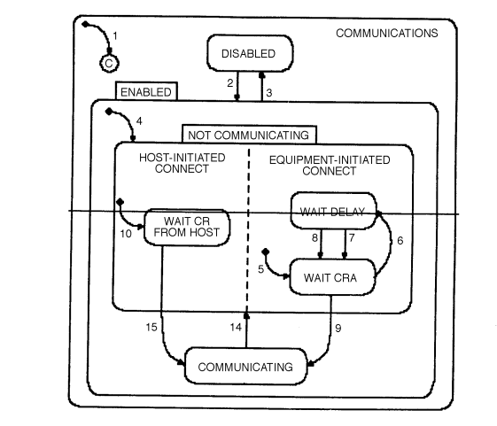
Figure 3.2.1
Communications State Diagram

The states of the Communications State Model are defined as follows:

> 通信状态模式被定义如下：

DISABLED
In this state SECS-II communication with a host computer is non-existent. If the operator switches from ENABLED to DISABLED, all SECS-II communications must cease immediately. Any messages queued to send shall be discarded, and all further action on any open transactions and conversations shall be terminated.4 Handling of messages currently being transmitted is an issue for lower level message transfer protocols and is not addressed in this standard. The DISABLED state is a possible system default.

> DISABLE
> 在这种状态下，和主机之间不存在SECS-II通信。如果操作员从启用切换到禁用，所有的SECS-II通信必须立即停止。任何等待发送的消息都会被丢弃，任何打开的事务和会话都会立即中止。处理正在发送的消息不在本标准的范围内。

ENABLED
ENABLED has two substates, COMMUNICA- TING and NOT COMMUNICATING. Whenever communications are enabled, either during system initialization or through operator selection, the substate of NOT COMMUNICATING is active until communications are formally established. Lower-level protocols (such as SECS-I) are assumed to be functioning normally in that they are capable of supporting the communication of SECS- II syntax.
The ENABLED state is a possible system default.
> ENABLE
> ENABLE有两个子状态，COMMUNICATING和NOT COMMUNICATING。无论何时启用通讯，无论是系统初始化期间还是通过操作员的操作，默认激活的都是NOT COMMUNICATING状态，直到通信正式建立。

ENABLED/NOT COMMUNICATING
No messages other than S1,F13, S1,F14, and S9,Fx shall be sent while this substate is active. The equipment shall discard any messages received from the host other than S1,F13 or S1,F14 (Establish Communications Acknowledge). It shall also periodically attempt to establish communication with a host computer by issuing an S1,F13 until communications are successfully established. However, only one equipment-initiated S1,F13 transaction may be open at any time.
> Enable/Not Communicating
> 当这个子状态激活时，除了S1F13，S1F14和S9Fy之外，不能发送任何消息。除了S1F13和S1F14外，设备丢弃接受到的其他消息。设备定期发送S1F13命令与主机进行通信，直到通信成功建立。

The NOT COMMUNICATING state has two AND substates, HOST-INITIATED CONNECT and EQUIPMENT-INITIATED CONNECT, both of which are active whenever the equipment is NOT COMMUNICATING. These two substates clarify the behavior of the equipment in the event that both the equipment and the host attempt to establish communications during the same period of time5 .
> Not Communicating状态包含两个子状态，Host initiated connect和Equipment initiated connect【主机启动连接】和【设备启动连接】。当设备处于Not Communicating状态时，两个子状态都处于激活状态。这两个子状态阐明和主机在同一时间段内试图建立通信时的设备行为。

NOT COMMUNICATING/EQUIPMENT-INITIATED CONNECT
This state has two substates, WAIT CRA and WAIT DELAY. Upon any entry to the NOT COMMUNICATING state, whenever EQUIPMENT-INITIATED CONNECT first becomes active, a transition to WAIT CRA occurs, the CommDelay timer is set to “expired,” and an immediate attempt to send S1,F13 is made.
> Not Communicating/Equipment initiated connect
> Equipment initiated connect包含两个分支，wait cra和wait delay。在Not Communicating状态下，只要Equipment initiated connect第一次激活，就会发生wait cra状态的转换。CommDelay计时器被设置为超时，并立即尝试发送S1F13

NOT COMMUNICATING/EQUIPMENT-INITIATED CONNECT/WAIT CRA
An Establish Communications Request has been sent. The equipment waits for the host to acknowledge the request.
> Not Communicating/Equipment initiated connect/wait cra
> 建立通信请求已经发送，设备等待主机确认请求。

NOT COMMUNICATING/EQUIPMENT-INITIATED CONNECT/WAIT DELAY
A connection transaction failure has occurred. The CommDelay timer has been initialized. The equipment waits for the timer to expire.
> Not Communicating/Equipment initiated connect/wait delay
> 发生了连接事务失败。CommDelay计时器已被初始化，设备等待CommDelay计时器超时。

NOT COMMUNICATING/HOST-INITIATED CONNECT
This state describes the behavior of the equipment in response to a host-initiated S1,F13 while NOT COMMUNICATING is active.
> Not Communicating/Host Initiated Connect
> 该状态描述了在Not Communicating状态下，设备对主机发起的S1F13的响应行为

NOT COMMUNICATING/HOST-INITIATED CONNECT/WAIT CR FROM HOST
The equipment waits for an S1,F13 from the host. If an S1,F13 is received, the equipment attempts to send an S1,F14 with COMMACK = 0.
> Not Communicating/Host initiated connect/wait cr from host
> 设备等待来自主机的S1F13。如果收到了S1F13，设备发送CommAck=0的S1F14

ENABLED/COMMUNICATING
Communications have been established. The equipment may receive any message from the host, including S1,F13. When the equipment is COMMUNICATING, SECS communications with a host computer must be maintained. This state remains active until communications are disabled or a communication failure occurs. If the equipment receives S1,F13 from the host while in the COMMUNICATING substate, it should respond with S1,F14 with COMMACK set to zero. If the equipment receives S1,F14 from a previously sent S1,F13, no action is required.
> Enable/Communicating
> 通信已经建立。设备可以接受来自主机的任何信息，包括S1F13。当设备处于Communicating状态时，必须保持与主机的SECS通信。该状态一直处于激活状态，直到通信被禁止或者发生通信故障。如果设备在Communicating状态下收到了来自主机的S1F13，应该用CommAck=0的S1F14消息响应。如果设备从之前发送的S1F13中收到了S1F14，则不需要任何动作。

In the event of communication failure, the equipment shall return to the NOT COMMUNICATING substate and attempt to re- establish communications with the host.
> 在communication failure的情况下，设备应返回到Not Communicating子状态，并尝试与主机重新建立通信

It is possible that the equipment may be waiting for an S1,F14 from the host in EQUIPMENT- INITIATED CONNECT/WAIT CRA at the time an S1,F13 is received from the host in HOST- INITIATED CONNECT/WAIT CR FROM HOST. When this situation occurs, both equipment and host have an open S1,F13/S1,F14 transaction. Since communications are successfully established on the successful completion of any S1,F13/S1,F14 transaction, either of these two transactions may be the first to complete successfully and to cause the transition from NOT COMMUNICATING state to COMMUNICATING. In this event, the other transaction shall remain open regardless of the transition to COMMUNICATING until it is closed in a normal manner.
> 设备在Equipment initiated connect/wait cra状态下等待主机的S1F14消息时，有可能在Host initiated connect/wait cr from host状态下收到来自主机的S1F13。在这种情况发生时，设备和主机都会存在一个打开的S1F13/S1F14事务。由于通信是在任何S1F13/S1F14事务成功完成后建立的，这两个事务中的任何一个都可能第一个成功且使状态从Not Communicating过渡到Communicating。在这种情况下，另一个事务保持开放，直到收到S1F14后关闭事务，此时无状态转换。

If the equipment has not yet sent6 an S1,F14 to a previously received S1,F13 at the time when COMMUNICATING becomes active, the S1,F14 response shall be sent in a normal manner. A failure to send the S1,F14 is then treated as any other communication failure.
> 如果在Communicating激活时，设备没有对之前的收到的S1F13响应S1F14，则应以正常方式发送S1F14响应。没有成功发送S1F14的情况会触发communication failure。

If the equipment-initiated S1,F13/S1,F14 is still open when the transition to COMMUNICATING occurs,  subsequent  failure to receive a reply from the host is considered a communication fault by equipment. An S9,F9 should be sent when a transaction timer timeout occurs7. (See Section 4.9 for definitions of communication faults and message faults, as well as detail on Stream 9 Error Messages.)
> 如果在过渡到Communicating状态时，设备发起的S1F13/S1F14事务还是开放的，且随后没有能收到主机的回复，会被认为是设备的通信故障。当发生事务计时器超时时，应发送S9F9，详细参考4.9

3.2.5 State Transitions

> 设备转换

Table 3.2 contains a full description of the state transitions depicted in Figure 3.2.1.
> 表3.2包含了对图3.2.1中描述的状态转换的完整描述

When the operator switches from the DISABLED state to the ENABLED state, no collection event shall occur, since no messages can be sent until communications have been established. The process of establishing communications serves to notify the host that communications are ENABLED. No other collection events are defined for the Communications State Model.
> 当操作员从Disable切换到Enable状态时，不会触发任何collection event，因为在建立通信之前不能发送任何消息。建立通信的过程的目的是为了通知主机，通信是enable的。

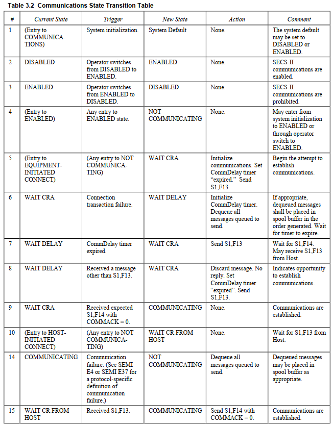

### 3.3 Control State Model

> Control状态模型

The CONTROL state model defines the level of cooperation between the host and equipment. It also specifies how the operator may interact at the different levels of host control. While the COMMUNICATIONS state model addresses the ability for the host and equipment to exchange messages, the CONTROL model addresses the equipment’s responsibility to act upon messages that it receives.

> Control状态模型定义了主机和设备之间的控制等级。他还规定了操作员如何在主机控制的不同等级上进行交互。通信状态模型解决了主机和设备交换信息的能力，而控制状态模型解决了设备对他所收到信息而采取的行动。

The CONTROL model provides the host with three basic levels of control. In the highest level (REMOTE), the host may control the equipment to the full extent possible. The middle level (LOCAL) allows the host full access to information, but places some limits on how the host can affect equipment operation. In the lowest level (OFF-LINE), the equipment allows no host control and only very limited information.

> 控制模式为主机提供了三个基本的控制级别。
>
> 1. 最高控制级别为remote，主机可以在最大程度上控制设备。
> 2. 中间级别为local，允许主机完全访问信息，但对主机如何影响设备的运行有一些限制
> 3. 最低级别为off-line，设备不允许主机控制，只允许非常有限的信息

The control model and communications model (when implemented) do not interact directly. That is, no action or state of one model directly causes a change in behavior of the other. It is true, however, that when the communication state is NOT COMMUNICATING then most message transaction are not functional. When messages cannot be transmitted, the control capabilities and all other GEM capabilities are affected.

> 控制模型和通信模型是相互独立的，一个模型的动作/状态并不会影响另一个模型。然而当通信状态为Not Communicating时，大多数的事务都不起作用。当消息无法发送时，控制能力和其他Gem功能都会受到影响。

Refer to Figure 3.3 as the CONTROL substates and state transitions are defined.

> Control状态和转换的定义参考图3.3，

OFF-LINE
When the OFF-LINE state is active, operation of the equipment is performed by the operator at the operator console. While the equipment is OFF-LINE, message transfer is possible. However the use of messaging for any automation purpose is severely restricted. While the OFF-LINE state is active, the equipment will only respond to those messages used for the establishment of communications or a host request to activate the ON- LINE state.
> Off-line
> 当Off-line状态激活时，设备的操作由操作员在设备上进行。当设备处于Off-Line状态时，可以进行信息传输。但是任何自动化的使用信息传递都会受到严格限制。当Off-Line状态激活时，设备只对那些用于建立通信的信息或者主机要求激活On-Line状态的信息做出反应。

While OFF-LINE, the equipment will respond with an Sx,F0 to any primary message from the host other than S1,F13 or S1,F17. It will process and respond to S1,F13 and S1,F17. S1,F17 is used by the host to request the equipment to transition to the ON-LINE state. The equipment will accept this request and send a positive response only when the HOST OFF-LINE state is active (see transition 11 definition below).
> 在off-line状态下，设备将以SxF0响应主机发送的除S1F13或S1F17以外的任何主消息，仅响应和处理S1F13和S1F17。S1F17被主机用来请求设备过渡到On-Line状态。只有当Host-OffLine状态激活时，设备才会接受这个请求，并发送一个响应，参考转换11

While the OFF-LINE state is active, the equipment shall attempt to send no primary message other than S1,F13,10 S9,Fx,11 and S1,F1 (see ATTEMPT ON-LINE substate). If the equipment receives a reply message from the host other than S1,F14 or S1,F2, this message is discarded.
> 当Off-Line状态激活时，虽然设备可以尝试发送除了S1F13，S9Fy，和S1F1以外的任何主消息，但是设备受到主机发出的S1F14或者S1F2以外的任何次消息，都不会进行响应。

No messages enter the spool when the system is OFF- LINE. Spooling may be active when the Communications State of NOT COMMUNICATING is active. This might occur during OFF-LINE, but since the equipment will not attempt to send messages except as mentioned in the previous paragraph12, no messages will enter the spool.

> 当系统处于Off-Line状态时，没有信息进入spool。当通信状态为Not Communicating时，spooling也可能激活。由于在Off-Line状态下，设备不会试图发送消息，没有信息会进入spool

OFF-LINE has three substates: EQUIPMENT OFF-LINE, ATTEMPT ON-LINE, and HOST OFF-LINE.

> Off-Line有三个子状态，Equipment OffLine，Attempt OnLine，Host OffLine

OFF-LINE/EQUIPMENT OFF-LINE
While this state is active, the system maintains the OFF-LINE state. It awaits operator instructions to attempt to go ON-LINE.
> OffLine/Equipment OffLine
> 当这个状态被激活时，系统会一直保持OffLine状态，直到操作员尝试进入OnLine状态

OFF-LINE/ATTEMPT ON-LINE
While the ATTEMPT ON-LINE state is active, the equipment has responded to an operator instruction to attempt to go to the ON-LINE state. Upon activating this state, the equipment attempts to send an S1,F1 to the host.
> OffLine/Attempt OnLine
> 当这个状态被激活时，表示设备已经响应了操作员的指令，正在尝试进入OnLine状态。激活该状态后，设备会向主机发送S1F1

Note that when this state is active, the system does not respond to operator actuation of either the ON-LINE or the OFF-LINE switch.
> 注意，当这个状态被激活时，系统不会响应操作员对OnLine和OffLine开关的操作。

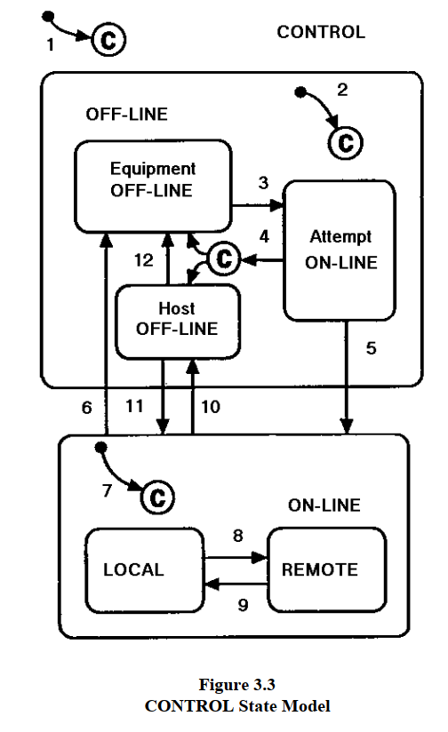

OFF-LINE/HOST OFF-LINE
While the HOST OFF-LINE state is active, the operator’s intent is that the equipment be ON-LINE. However, the host has not agreed. Entry to this state may be due to a failed attempt to go ON-LINE or to the host’s request that the equipment go OFF-LINE from ON-LINE (see the transition table for more detail). While this state is active, the equipment shall positively respond to any host’s request to go ON-LINE (S1,F17). Such a request shall be denied when the HOST OFF- LINE state is not active.

> OffLine/Host OffLine
> 当该状态被激活的时候，表示设备的状态是OnLine，但是主机并没有同意。进入该状态可能是由于尝试进入OnLine状态失败，或者是由于主机要求设备从OnLine状态进入OffLine状态。当此状态激活时，设备要响应任何主机的OnLine请求S1F17。当Host OffLine状态未激活时，S1F17会被拒绝。

ON-LINE
While the ON-LINE state is active, SECS-II messages may be exchanged and acted upon. Capabilities that may be available to the host should be similar to those available from the operator console wherever practical.

> 在OnLine状态下，可以交换SECS-II信息，并对其采取行动。在可行的情况下，主机具备的功能应与设备提供的功能类似。

The use of Sx,F0 messages is not required while the ON-LINE state is active. Their use is discouraged in this case. The only allowed use is to close open transactions in conjunction with message faults.

> 在OnLine状态下，不需要使用SxF0信息。唯一允许的使用是和message fault一起关闭开放的事务

ON-LINE/LOCAL
Operation of the equipment is implemented by direct action of an operator. All operation commands shall be available for input at the local operator console of the equipment.

> OnLine/Local
> 设备的操作是由操作员直接操作的，所有的操作都可以在设备上实现

The host shall have the following capabilities and restrictions when the LOCAL state is active:

> 当local状态激活时，主机应具备以下能力：

- The host shall be prohibited from the use of remote commands that cause physical movement or which initiate processing. During processing, the host shall be prohibited from the use of any remote command that affects that process.
  
  > 主机被禁止使用引起物理运动或者启动处理的远程命令。在设备运动过程中，禁止主机使用任何影响该运动的远程命令
- During processing, the host shall be prohibited from modifying any equipment constants that affect that process. Other equipment constants shall be changeable during processing. The host shall be able to modify all available equipment constants when no processing is in progress.
  
  > 在设备处理过程时，禁止主机修改任何影响该过程的设备常量。其他设备常量在处理过程中应该是可以改变的。在没有进行处理过程的时候，主机可以修改所有可用的设备常量。
- The host shall be capable of initiating the upload and download of recipes to/from the recipe storage area on the equipment. The host shall be capable of selecting recipes for execution so long as this action does not affect any currently executing recipe.
  
  > 主机能够从设备的配方存储区上传和下载配方。主机能够选择要执行的配方，只要该行动不影响任何当前执行的配方
- The host shall be able to configure automatic data reporting capabilities including alarms, event reporting, and trace data reporting. The host shall receive all such reports at the appropriate times.
  
  > 主机能配置自动数据报告功能，包括报警，事件报告和跟踪数据报告。主机应能在适当的时候接受这些报告
- The host shall be able to inquire for data from the equipment, including status data, equipment constants, event reports, process program directories, and alarms.
  
  > 主机能从设备中查询数据，包括状态数据，设备常量，事件报告，过程程序目录和报警
- The equipment shall be able to perform Terminal Services as defined in GEM.
  
  > 设备能执行GEM中定义的终端服务

The host shall be allowed any other capabilities that were not specifically restricted in the above items as long as the LOCAL state is active.

> 只要Local状态被激活，就应该允许主机具有上述能力

NOTE 2: Capabilities mentioned above which are not implemented on a specific equipment may be ignored in this context.

> 注意：上面提到的能力如果没有在具体设备上实现，在此情况下可以忽略

ON-LINE/REMOTE
For equipment which supports the GEM capability of remote control (see Section 4.4), while the REMOTE state is active, the host shall have access, through the communications interface, to the necessary commands to operate the equipment through the full process cycle in an automated manner. The equipment does not restrict any host capabilities when REMOTE is active. The degree of control executed by the host may vary from factory to factory. In some cases, the operator maybe required to interact during remotely controlled processes. This interaction may involve set-up operations, operator assist situations, and others. This state is intended to be flexible enough to accommodate these different situations.

> OnLine-Remote
> 对于支持GEM远程控制能力的设备（见4.4节）当remote状态激活时，主机应该能通过通信接口获得必要的命令，以自动方式操作设备。当Remote处于激活状态时，设备不限制任何主机能力。主机执行的控制程度可能因工厂而异。在某些情况下，操作员可能需要在远程控制过程中进行互动。这种互动可能涉及设置操作，操作者协助等情况。这种状态的目的是为了灵活的适应这些不同的情况。

To support the different factory automation policies and procedures, it shall be possible to configure the equipment to restrict the operator in specific non-emergency procedures. These restrictions shall be configurable so that the equipment may be set up to allow the operator to perform necessary functions without contention with the host. The categories for configuration shall include (but are not limited to):

> 为了支持不同的工厂自动化政策和程序，应能对设备进行配置，以便在特定的非紧急程序中限制操作员。这些限制应是可配置的，以便设备可以被设置未允许操作员执行必要的功能，而不与主机发生争执。
> 配置的类别应包括但不限于：

- change equipment constants (process-related),
- change equipment constants (non-process-related),
- initiate process program download,
- select process program,
- start process program,
- pause/resume process program,
- operator assist,
- material movement to/from equipment,
- equipment-specific commands (on a command-by-command basis if needed).

> - 改变与工艺有关的设备常量
> - 改变与工艺无关的设备常量
> - 工艺程序下载
> - 选择工艺程序
> - 启动工艺程序
> - 暂停/恢复工艺程序
> - 操作员协助
> - 设备特定的命令

NOTE 3: Capabilities mentioned above which are not implemented on a specific equipment may be ignored in this context.

> 上面提到的能力如果没有在设备上实现，可以忽略

No capabilities that are available to the operator when the LOCAL state is active should be unconditionally restricted when the REMOTE state is active. The supplier may provide for configurable restriction of operator capabilities not included in the list above if desired. No configurability is necessary for any operator functions not available to the host.

> 当本地状态激活时，操作员可用的任何能力都不在远程状态激活时被无条件限制。如果需要，供应商可以对不包括上述列表中的操作员能力进行可配置的限制。对于主机无法使用的操作员功能，没有必要进行配置

The control functions must be shared to some degree between the host and the local operator. At the very least, the operator must have the capability to change the CONTROL state, actuate an Emergency Stop, and interrupt processing (e.g., STOP, ABORT, or PAUSE).

> 控制功能必须在一定程序上由主机和本地操作者共享。至少，操作者必须有能力改变控制状态，执行紧急停止以及中断处理。

All of these capabilities except Emergency Stop may be access-limited.13

> 除了紧急停止外，所有这些功能都可以限制访问

The host software should be designed to be compatible with the capabilities allotted to the operator.

> 主机软件的设计应和分配给操作员的能力兼容

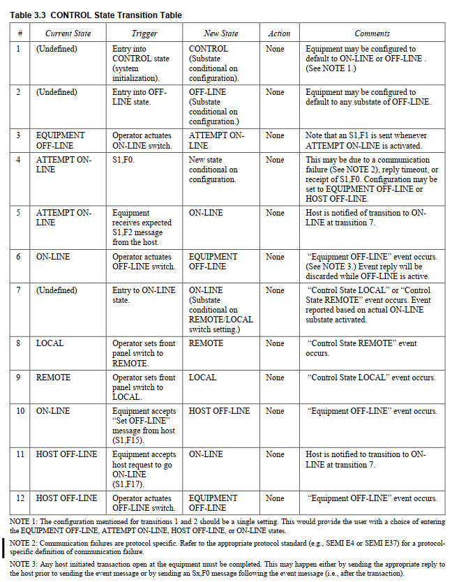

### 3.4 Equipment Processing States

> 设备处理状态

The behavior of the equipment in the performance of its intended function must be documented. This processing state model is highly dependent on the equipment process, technology, and style. However, there are expected to be common aspects to these models.

> 设备在执行预定功能时的行为必须被记录下来。这种处理状态模型很大程度上取决于设备的工艺，技术和风格。然而，这些状态模型有一些共性的内容。

The Processing State Diagram, Figure 3.4, is provided as an example of an implementation model. This model demonstrates the expected nature of the processing state model documentation. There is no requirement that these specific states be implemented.

> 处理状态图，图3.4，是一个例子。这个模型展示了处理状态模型文件的预期，并非所有的状态都必须要实现

The equipment must generate collection events for each processing state transition, as well as provide status variables (ProcessState, PreviousProcessState) whose values are the current processing state and the previous processing state.

> 设备必须为每个处理状态的转换产生Collection Event，以及提供状态变量（Process State 和 Previous Process State）这两个值分别为当前处理状态和上一个处理状态。

In referring to the Processing State Diagram, note that the initialization state INIT is not an actual processing state. It is shown here simply to indicate that the IDLE processing state is entered upon completion of equipment system initialization. On the following pages detailed descriptions are provided for the equipment processing states and state transitions (numbered) as shown in the diagram.

> 在参考处理状态图时，注意初始化状态Init并非一个实际的处理状态。在这里他只表示系统系统初始化完成后进入IDLE处理状态。后续将对图中所示的设备处理状态和状态转换（编号）进行详细描述。

3.4.1 Description of Equipment Processing States

> 3.4.1 设备处理状态的描述

IDLE
In this state the equipment is awaiting instructions.

> 空闲
> 在这种状态下，设备在等待指令

PROCESSING ACTIVE
This state is the parent of all substates where the context of process program execution exists.

> 运行激活
> 这个状态是所有子状态的父状态，这些子状态存在程序执行

PROCESS
This state is the parent of those substates that refer to the active preparation and execution of a process program.

> 运行
> 该状态是指主动准备和执行进程的子状态的父状态

SETUP
In this state all external conditions necessary for process execution are satisfied, such as ensuring material is present at the equipment, input/output ports are in the proper state, parameters such as temperature and pressure values are within limits, etc. If all setup operations are already complete, then this becomes a fall through state and a transition to the next state takes place.

> 设置
> 在该状态下，所有工艺执行所需的外部条件都得到了满足，例如，确保材料在设备上，输入/输出端口处于合适的状态，温度和压力值等参数在限制范围内等等。如果所有的设置操作都已经完成，那么这就成为一个过渡状态，并过渡到下一个状态

READY
In this state the equipment is ready for process execution and is awaiting a START command from the operator or the host.

> 准备就绪
> 在此状态下，设备已准备好执行工艺，并等待操作人员或者主机发出的启动命令

EXECUTING
Executing is the state in which the equipment is executing a process program automatically and can continue to do so without external intervention.

> 执行
> 执行是指设备自动执行Process Program的状态，并且可以在没有外部干预的情况下持续执行

PAUSE
In this state processing is suspended and the equipment is awaiting a command.

> 暂停
> 在这种状态下，处理被暂停，设备等待一个指令

Each state transition is defined in the following table. Note that all transitions in this table should be considered collection events.

> 每个状态的转换在下表中有定义。请注意，本表中所有的转换都应被视为Collection Event

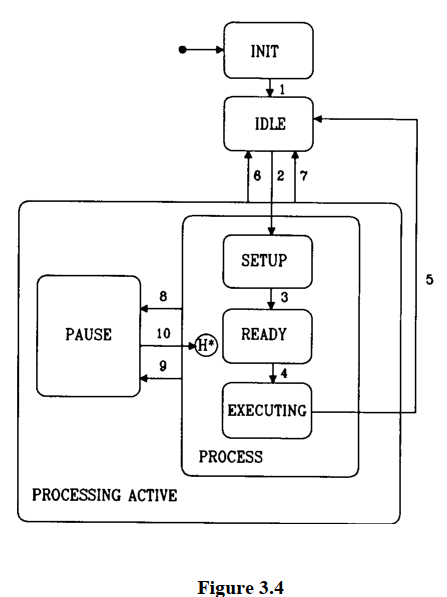

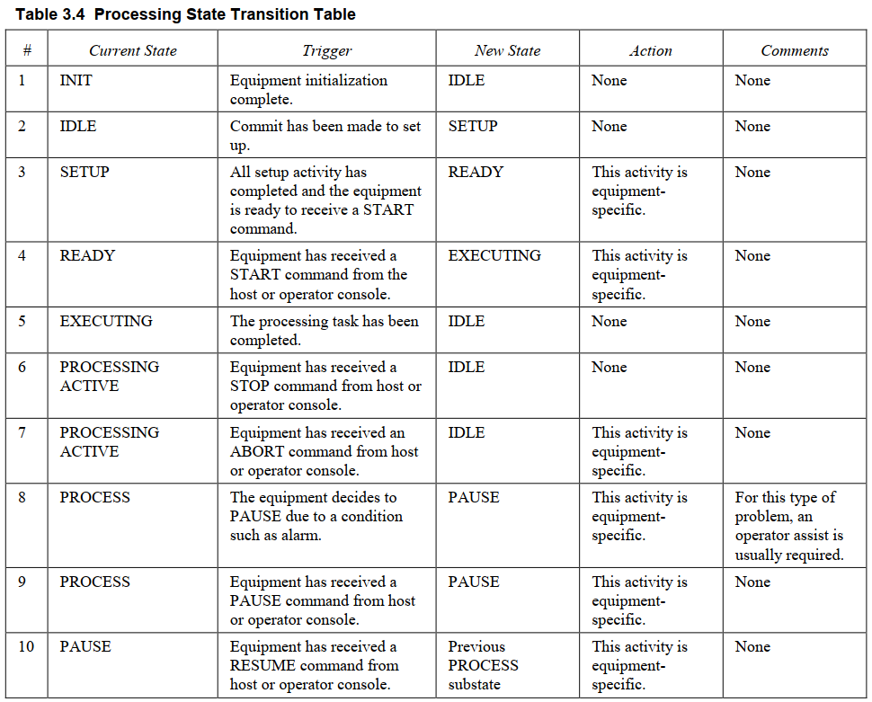

## 4. Equipment Capabilities and Scenarios

> 第四章 设备能力和场景

This section describes the details of the capabilities required by GEM and provides scenarios for their use. Capabilities are operations performed by semiconductor manufacturing equipment. These operations are initiated through the communications interface using SECS-II messages. A scenario is a group of SECS-II messages arranged in a sequence to perform a capability. Other information may be included with the scenario for clarity. For each capability, the reader is provided with a statement of purpose, pertinent definitions, a detailed description, requirements, and scenarios.

> 本章描述了GEM要求的功能的细节，并且提供了使用方案。功能指的是半导体设备可以执行的操作。这些操作是通过信息接口使用SECS-II信息启动的，一个场景指的是一组按顺序排列的SECS-II信息，以执行一个功能。为了清楚起见5，场景中还可以包含其他信息。对于每一个功能，读者可以获得目的定义，详细描述，要求和场景。

The following capabilities are discussed:

> 下面这些功能会被讨论

- Establish Communications | 建立通讯
- Event Notification  | 事件通知
- Dynamic Event Report Configuration | 动态事件报告配置
- Variable Data Collection  | 变量数据收集
- Trace Data Collection | 追踪数据收集
- Limits Monitoring | 极限监控
- Status Data Collection  | 状态数据收集
- On-line Identification  | 在线识别
- Alarm Management  | 报警管理
- Remote Control  | 远程控制
- Equipment Constants | 设备常量
- Process Program Management  | 工艺程序管理
- Material Movement | 物料输送
- Equipment Terminal Services | 设备终端服务
- Error Messages  | 错误信息
- Clock | 时钟
- Spooling  | 脱机
- Control | 控制

### 4.1 Establish Communications

> 4.1 建立通讯

The Establish Communications capability provides a means of formally establishing communications following system initialization or any loss of communications between communicating partners, and thus of notifying the communication partner that a period of non-communication has occurred.

> 建立通信功能提供一个方法，用于在系统初始化后或者通信丢失后正式建立通信，从而通知Host发生了一段时间的非通信。

4.1.1 Purpose
Communications between host and equipment are formally established through use of the Establish Communications Request/Establish Communications Acknowledge transaction. The use of S1,F1/F2 for this purpose is ambiguous since the transaction can be used for other purposes and may occur at any time.

> 4.1.1 目的
> 通过使用"建立通信请求/建立通信确认"事务，正式建立Host和Equipment之间的通信。不能使用S1F1/S1F2事务，因为该事务可以用于其他目的，并且可以在任何时候发生。

The S1,F13/F14 transaction, used in conjunction with the Communications State Model, provides a means for equipment to notify the host, or the host to notify the equipment, that there has been a period of inability to communicate. The successful completion of this transaction also signals a possible need for synchronization activities between host and equipment.
> S1F13/S1F14事务和通信状态模型一起使用，表示设备和主机之间有一段时间无法通信。该事务的成功也预示着主机和设备之间可能需要进行同步活动。

4.1.2  Definitions

> 定义

- COMMACK

Acknowledge code returned in the Establish Communications Acknowledge message. See the SEMI E5 Standard for a full definition of this data item.

> 建立通信确认消息中返回的确认代码。有关该数据项的完整定义，参考SEMI E5

- EstablishCommunicationsTimeout

An equipment constant used to initialize the interval between attempts to re-send an Establish Communications Request. This value specifies the number of seconds for the interval. See the SEMI E5 Standard for a full definition of this variable data item.

> 设备常量，用于初始化尝试重新发送建立通信请求的间隔时间。该值规定了间隔时间的秒数，有关该变量数据项的完整定义，参考SEMI E5

4.1.3 Description

> 描述

There are potential problems when one side of the communications link fails and the other side does not detect it. From the point of view of the host, a loss of communications has many possible causes. In some cases, host-controlled settings on the equipment may need to be reset. In other cases, the equipment may have continued an automatic processing sequence during the period of no communication and may have changed states. The definition of a formal protocol for establishing communications alerts the host to the need to synchronize itself with the equipment’s current status.

> 当通信链路的一方出现故障，而另一方没有发现时，就会出现潜在的问题。从主机的角度来看，通信中断有许多可能的原因。在某些情况下，设备上由主机控制的设置可能需要重置。在其他情况下，设备可能在无通信期间自动处理序列，并可能改变了状态。建立通信的正式协议的定义提醒主机需要将自己和设备的当前状态同步。

Equipment shall consider communications as formally established whenever either of the following conditions have been satisfied:

> 只要满足以下任一条件，设备就应认为通信正式建立：

- Communications Request has been sent to the host and an Establish Communications Acknowledge has been received within the transaction timeout period and with an acknowledge code of Accept, or
- Communications Request has been received from the host, and an Establish Communications Acknowledge response has been successfully sent with an acknowledge code of Accept.

> - 已向主机发送通信请求，并在事务超时期间内收到建立通信代码为接受的确认信息
> - 从主机收到通信请求，并且成功发送了响应代码为接受的建立通信响应

When the equipment sends an Establish Communications Request to the host, this notifies the host of the possible need to synchronize itself with the equipment.

> 当设备向主机发送建立通信请求时，这就通知主机可能需要与设备同步

When the equipment is attempting to establish communications, an Establish Communications Request shall be sent periodically until communications have been formally established as described above. The interval between attempts must be user-configurable and begins as soon as a connection transaction failure is detected (see Section 3.2).

> 当设备试图建立通信时，应定期发送建立通信请求，直到按照上述说明正式建立通信。尝试和尝试之间的间隔必须是用户可以配置的，并且在检测到连接事务失败时立即开始。

Attempting to establish communications is not a low-level connectivity issue, but rather a logical application issue used by either party to notify its partner that the host may need to perform synchronization activities with the equipment.

> 试图建立通信不是一个低层次的连接问题，而是一个逻辑应用问题，由任何一方来通知对方，主机可能需要与设备进行活动同步

4.1.4  Requirements

- Equipment must support the Communication State Model (see Section 3.2).
- Equipment must provide the EstablishCommunicationsTimeout equipment constant described above.

> 要求
>
> - 设备必须支持通信状态模型
> - 设备必须提供 Establish Communication Timeout 设备常量

4.1.5 Scenarios

> 4.1.5 场景

4.1.5.1 Host Attempts to Establish Communications

> 主机尝试建立通信

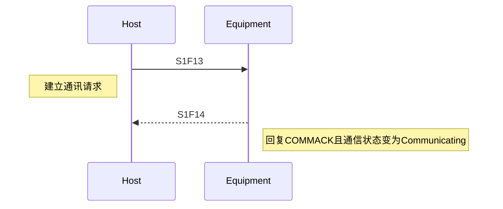

4.1.5.2  Equipment Attempts to Establish Communications and Host Acknowledges

> 设备尝试建立通信且主机回复

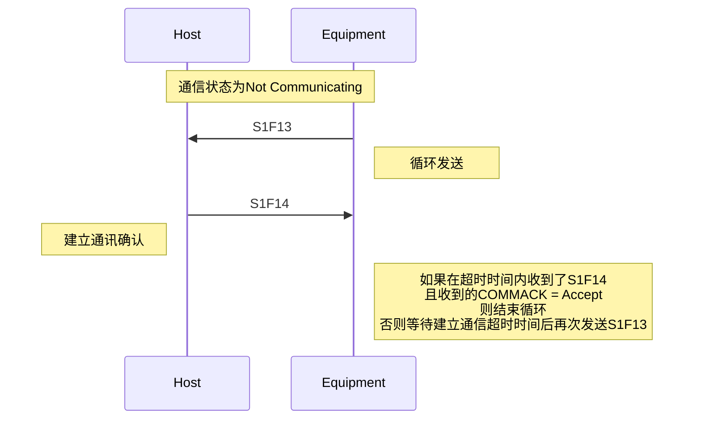

4.1.5.3 Simultaneous Attempts to Establish Communications

> 同时尝试建立通信

For equipment that supports interleaving, it is possible that either the host or equipment could send an Establish Communications Request before receiving the request from its partner. As communications are established by the successful acceptance of any one Establish Communications Request, it is immaterial who sends the request first. The roles of host and equipment may be reversed.
Equipment Receives S1,F14 From Host Before Sending S1,F14:

> 主机和设备可能在等待回复的时候，收到一个建立通信的请求。由于通信是通过成功接收任何一个建立通信请求而建立的，因此谁先发送请求并不重要，主机和设备的角色可以颠倒。
> 设备先收到S1F14

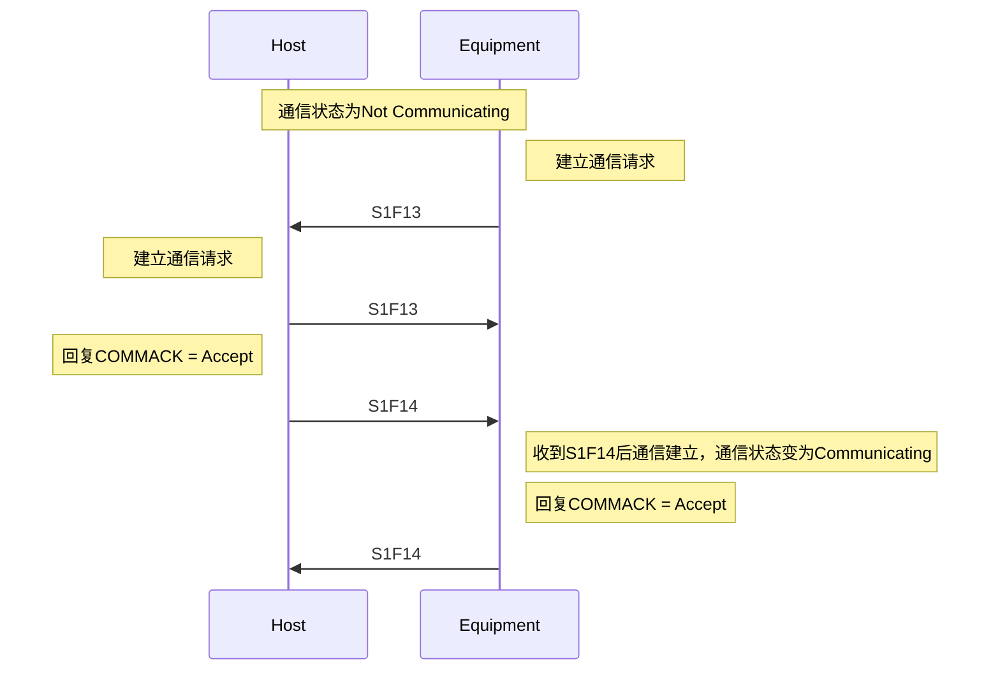

> 主机先收到S1F14

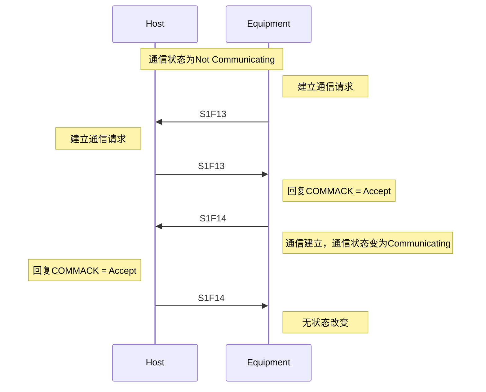

### 4.2 Data Collection

> 数据收集

Data collection allows the host to monitor equipment activity via event reporting, trace data reporting, limits monitoring, and query of selected status or other variable data.

> 数据收集允许主机通过事件报告，跟踪数据报告，极限监控，以及对状态和变量数据的查询来检测设备活动

4.2.1 Event Data Collection

Event data collection provides a dynamic and flexible method for the user to tailor the equipment to meet individual needs with respect to data representation and presentation to the host. The event-based approach to data collection provides automatic notification to the host of equipment activities and is useful in monitoring the equipment and in maintaining synchronization with the equipment.

> 4.2.1 事件数据收集
> 事件数据收集为用户提供了一种动态和灵活的方法，使设备在的数据表示和向主机展示方面满足自定义需求。基于事件的数据收集方法，为主机提供了设备活动的自动通知，在监控设备保持与设备的同步方面非常有用。

Event data collection may be broken into two logical parts: host notification when an event occurs and dynamic configuration of the data attached to the event notification.
> 事件数据收集分为两个逻辑部分：
>
> 1. 事件发生时的事件通知
> 2. 事件通知时发送数据的动态配置

4.2.1.1 Event Notification
This section describes the method of notifying the host when equipment collection events occur.

> 4.2.11 事件通知
> 本节介绍当设备采集事件发生时，通知主机的方法

4.2.1.1.1 Purpose
This capability provides data to the host at specified points in equipment operation. This asynchronous reporting eliminates the need for the host to poll the equipment for this information. Events on the equipment may trigger activity on the part of the host. Also, knowledge of the occurrence of events related to the equipment state models allows the host to track the equipment state. An equipment’s behavior is related to its current state. Thus, this capability helps the host understand how an equipment will behave and how it will react to host behavior.

> 4.2.1.1.1 目的
> 该功能在设备运行的指定点向主机提供数据。这种异步报告消除了主机为了获得信息而轮询的必要。设备上的事件可能会触发主机方面的活动。另外，和设备状态模型有关的事件发生，可以使主机能够跟踪设备状态。一个设备的行为可能与它当前状态有关。因此这种功能有助于主机了解设备即将做的事情，以及对主机的行为做出的反应。

4.2.1.1.2  Definitions

Collection Event — An event (or grouping of related events) on the equipment that is considered significant to the host.

Collection Event ID (CEID) — A unique identifier of a collection event. See the SEMI E5 Standard for a full definition of this data item.

Event — A detectable occurrence significant to the equipment.

Report — A set of variables predefined by the equipment or defined by the host via S2,F33/F34.

> 4.2.1.1.1 定义
>
> - Collection Event 采集事件
> 设备上的对主机有意义的事件（或一组相关的事件）
> - Collection Event ID 采集事件ID（CEID）
> 采集事件的唯一标识符，关于数据项的完整定义，参考SEMI E5
> - Event 事件
> 对设备有意义的且可检测的事件
> - Report 报告
> 一组由设备预定义或者由主机通过S2F33/S2F34定义的变量

4.2.1.1.3 Detailed Description

> 详细说明

The equipment supplier must provide a set of predefined collection events. Specific collection events are required by individual capabilities and state models. Examples of collection events include:

> 设备供应商必须提供一套预定义的收集事件。具体的收集事件是由设备的功能和状态模型决定的，收集事件的例子如下：

- The completion of each action initiated by a host requested command,
- Selected processing and material handling activities,
- Operator action detected by the equipment,
- A state transition,
- The setting or clearing of an alarm condition on the equipment, and
- Exception conditions not considered alarms.

> - 由主机发起命令的动作的完成
> - 选定的加工和材料处理活动
> - 设备检测到的操作员的动作
> - 状态转换
> - 设备上的报警的设置或者清楚
> - 不属于报警的其他情况

See Section 6 for a list of required collection events.

> 所需收集事件的清单参考第六章

The reporting of a collection event may be disabled per event by the user to eliminate unwanted messages. An event report message shall be sent to the host upon the occurrence of a particular collection event if the collection event (CEID) has been enabled. Attached to each event message is one or more event reports which contain variable data. Section 4.2.1.2 describes the capability which allows for the dynamic customization of event reports. The values of any data contained in an event report message must be current upon the occurrence of the event. This implies that event reports be built at the time of the event occurrence.

> 用户可以禁止每个事件的收集事件报告，以消除不需要的信息。如果采集事件（CEID）已被启用，再特定采集事件发生时，应向主机发送事件报告信息。每个事件信息都附有一个或多个事件报告，其中包含变量数据。4.2.1.2节描述了允许动态定制事件报告的能力。事件报告消息中包含的任何数据的值再事件发生时必须是最新的，这意味着报告是再事件发生时建立的。

The equipment shall also provide the S6,F15/F16 transaction to allow the host to request the data from a specific event report.

> 设备还应提供S6F15/S6F16事务，以允许主机请求特定事件报告的数据

4.2.1.1.4  Requirements

> 4.2.1.1.4 要求

- The equipment supplier shall provide documentation of all collection events defined on the equipment and the conditions for each event to occur.
- The equipment supplier shall provide unique CEIDs for each of the various collection events that are available for reporting.
- The equipment supplier shall provide a method for enabling and disabling the reporting of each event. This method shall either be available via the host interface (see Section 4.2.1.2) or the equipment’s operator console.
- For each event, the equipment supplier shall provide either
  1. a default set of report(s) linked to the event which contain data pertinent to that event, or
  2. the ability for the user to configure the data linked to that event via the equipment’s operator console or host interface (see Section 4.2.1.2).

> 设备供应商应提供设备上定义的所有采集事件的文档，以及每个事件发生的条件
> 设备供应商应提供可用于报告的每个收集事件的唯一CEID
> 设备供应商应提供启用和禁用每个事件报告的方法，该方法应通过主机接口或设备的操作台提供
> 对于每个事件，设备供应商应提供以下其中之一
>
> - 一套与事件相关的默认报告，其中包含与该事件有关的数据
> - 用户能够通过设备的操作台或主机接口配置与该事件相关的数据

4.2.1.1.5  Scenarios

Collection Event Occurs on the Equipment:

> 设备触发采集事件

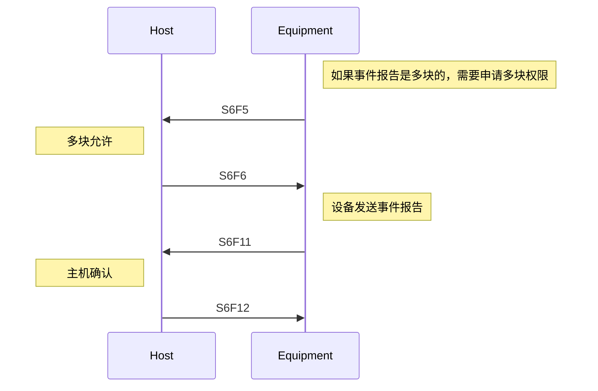

Host Requests Event Report:

> 主机请求事件报告

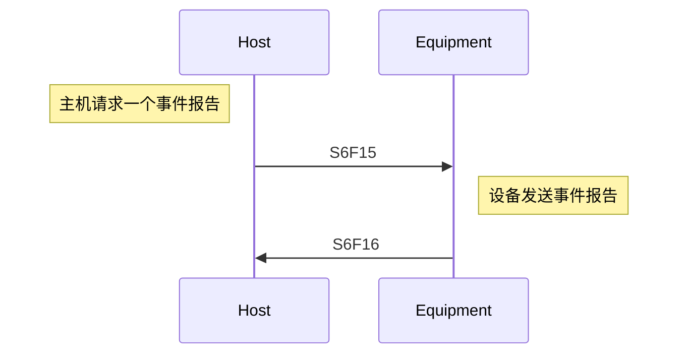

4.2.1.2 Dynamic Event Report Configuration

> 事件报告动态配置

This section describes a capability which allows the host to dynamically modify the equipment event reporting setup.

> 本节介绍一种允许主机动态修改设备事件报告设置的能力

4.2.1.2.1 Purpose

This capability is defined to provide the data reporting flexibility required in some manufacturing environments. It allows the host to increase or decrease the data flow according to need. For example, if the performance of an equipment degrades, the data flow from that equipment may be increased to help diagnose the problem.

> 4.2.1.2.1 目的
> 该功能的定义是为了提供某些制造环境所需的数据报告的灵活性，它允许主机根据需要增加或者减少数据流。例如一个设备的性能下降，就可以增加来自该设备的数据流以帮助诊断问题

4.2.1.2.2  Definitions

EventsEnabled — A variable data item that consists of a list of currently enabled collection events (CEIDs). See SEMI E5 for a full definition of this variable data item.
Report ID (RPTID) — A unique identifier of a specific report. See SEMI E5 for a full definition of this data item.
Variable Data (V) — A data item containing status (SV), data (DVVAL), or constant (ECV) values. See SEMI E5 for a full definition of this data item.
Variable Data ID (VID) — A unique identifier of a variable data item. The set of VID’s is the union of all SVID’s, ECID’s, and ID’s for DVVAL’s (DVNAME’s). See SEMI E5 for a full definition of this data item.

> 4.2.1.2.2 定义
>
> - Events Enable
> 一个变量数据项，由当前启用的采集事件（CEID）列表组成。有关该变量数据项的完整定义，参考SEMI E5
> - 变量数据（V）
> 包含状态（SV）数据（DVVAL）或者常量（ECV）的数据项。有关该数据项的完整定义，参考SEMI E5。
> - 变量数据ID（VID）
> 变量数据项的唯一ID。VID的集合是所有SVID，ECID和DVID的集合。有关该数据项的完整定义，参考SEMI E5

4.2.1.2.3  Detailed Description

The equipment shall support the following event report configuration functionality through the SECS-II interface:
— Host definition/deletion of custom reports,
— Host linking/unlinking of defined reports to specified collection events, and
— Host enabling/disabling the reporting of specified collection events.
NOTE 4: The equipment may also supply alternative means for defining reports and linking reports to events (e.g., via the operator console). Implementation of alternate means is not required.

The equipment can be instructed by the host to enable or disable reporting of collection events on an individual or collective basis. A status value (SV) shall be available that consists of a list of enabled collection events. (See Section 5.2, Variable Item List, EventsEnabled variable.)

Reports may be attached to an event report message (S6,F11). These reports are specifically linked to the desired event and typically contain variable data relating to that event. The reports may be provided by the equipment supplier or created by the user. The user must be able to create reports and link them to events via the SECS-II interface.

The data reported in the event report messages may consist of Status Values (SV’s), Equipment Constant Values (ECV’s), or Data Values (DVVAL’s). Note that data values shall be valid and current on certain events and certain states and might not be current at other times. The implementor shall document when a data value will be current and available for reporting.

> 4.2.1.2.3 详细说明
> 设备应通过SECS-II接口支持以下事件报告配置功能
>
> - 主机对自定义报告的定义/删除
> - 主机将定义的报告与指定的收集事件链接或者断开链接
> - 主机启用/禁用指定采集事件的报告
> 注意：设备也可以提供定义报告和将报告与事件链接的方法，不强制要求
>
> 主机可以指示设备再个别或者集体的基础上启用或禁用事件的报告。应提供一个SV，包括所有已启用的收集事件的列表。（参考5.2节，变量项列表，EventsEnable变量）
>
> 报告可以附在事件报告函数（S6F11）中。这些报告专门与所需的事件相联系，通常包含与该事件有关的变量数据。报告可以由设备供应商或者由用户创建。用户必须能够创建报告，并通过SECS-II接口将其与事件联系起来。
>
> 事件报告函数中报告的数据可由状态值（SV），设备常量值（ECV）或数据值（DVVal）组成。注意，数据值在某些事件和某些状态下必须是有效的且是最新的。在其他时间下，可能不是最新的。实施者应记录数据值何时有效并可用于报告。

4.2.1.2.4  Requirements
— The equipment manufacturer must provide documentation of all variable data available from the equipment. This is to include variable name, variable type or class (SV, ECV, DVVAL), units, format codes, possible range of values, and a description of the meaning and use of this variable.
— The equipment manufacturer must provide unique VIDs for the various variable data (V) available for data collection in the equipment. For example, this means that no SV shall have a VID which is the same as the VID of any ECV or DVVAL.
— All variable data must be available for report definition and event data collection. See Section 5.2, Variable Item List, for a list of required variable data.
— All report definitions, report-to-event links, and enable/disable status of event reports must be retained in non-volatile storage.

> 4.2.1.2.4 要求
>
> 设备制造商必须提供设备中所有变量数据的文档。这要包含变量名称，变量类型或类别（SV，ECV，DVVal），单位，格式代码，可能的取值类型，以及该变量的意义和用途的描述
> 设备制造商必须为设备中可用于数据采集的各种变量数据（V）提供唯一的VID。例如，SV的VID不可以和任何ECV或DVVal的VID相同
> 所有变量数据必须可以用于报告定义和事件数据收集。有关所需变量数据的清单，参考5.2节，变量项目列表
> 所有报告定义，报告到事件链接以及事件报告的启用/禁用必须保存在非易失性存储中

4.2.1.2.5  Scenario

> 4.2.1.2.4 场景

Collection Event Reporting Set-up:

> 采集事件报告配置

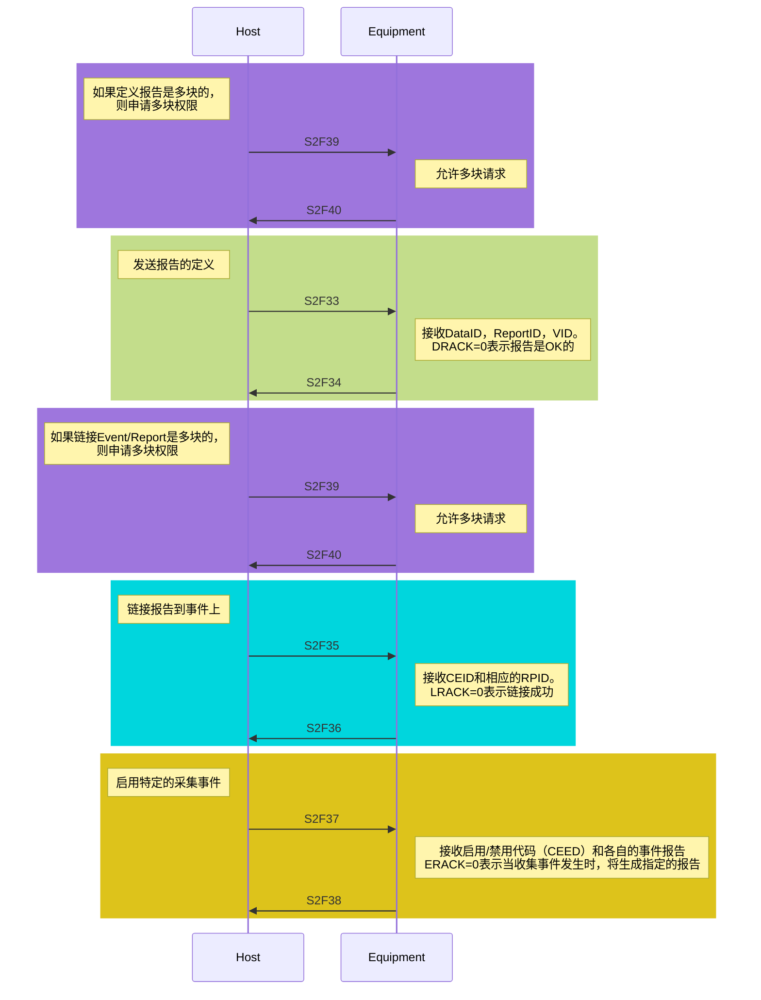

4.2.2 Variable Data Collection

> 数据变量收集

4.2.2.1  Purpose

> 目的

This capability allows the host to query for the equipment data variables and is useful during initialization and synchronization.

> 该功能允许主机查询设备变量数据，在初始化和同步期间非常有用

4.2.2.2  Definitions

> 定义

- Report ID (RPTID)
A unique identifier of a specific report. See SEMI E5 for a full definition of this data item.
- Variable Data (V)
A variable data item containing status, discrete, or constant data. See SEMI E5 for a full definition of this data item.

> Report ID(RPID)
> 报告的唯一标识符。该数据项的完整定义见SEMI E5
> 变量数据（V）
> 包含状态，离散或恒定数据的变量。该数据项的完整定义参考SEMI E5

4.2.2.3 Detailed Description
The host may request a report containing data variables from the equipment by specifying the RPTID. It is assumed that the report has been previously defined (e.g., using the Define Report S2,F33 transaction (see Section 4.2.1)). The values of any status variables (SV’s) and equipment constants (ECV’s) contained within the report must be current. Discrete data values (DVVAL’s) are only guaranteed to be valid upon the occurrence of a specific collection event. If DVVAL cannot be specified in equipment due to some restrictions depend on hardware and/or software conditions, the zero length item is reported.

> 4.2.2.3 详细描述
> 主机可以通过指定的RPID，向设备请求一份包含数据变量的报告。假设该报告之前已经被定义。报告中包含的任何SV和EC的值都必须是最新的。离散数据值DVVal只保证在特定事件发生时有效。如果由于某些原因导致DVVal无法获取，则报告为长度为0的列表

4.2.2.4  Requirements
— Variable data items (V’s) and associated units of measure must be provided by the equipment manufacturer.

> 4.2.2.4 要求
> 变量数据和相关的计量单位必须由设备制造商提供

4.2.2.5 场景

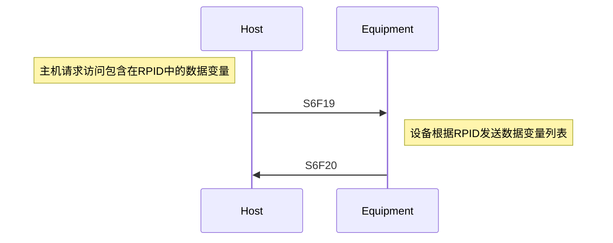

4.2.3 Trace Data Collection

> 追踪数据采集

4.2.3.1 Purpose

Trace data collection provides a method of sampling data on a periodic basis. The time- based approach to data collection is useful in tracking trends or repeated applications within a time window, or monitoring of continuous data.

> 目的
> 追踪数据采集提供了一种定期采集数据的方法。基于时间的数据采集方法在监测连续数据时非常有用。

4.2.3.2  Definitions

Data Sample Period (DSPER) — The time delay between samples. See SEMI E5 for a full definition of this data item.

Reporting Group Size (REPGSZ) — The number of samples included per trace report transmitted to the host. See SEMI E5 for a full definition of this data item.

Status Variable (SV) — Status data item (included in trace report). See SEMI E5 for a full definition of this data item.

Status Variable ID (SVID) — A unique identifier of a status variable. See SEMI E5 for a full definition of this data item.

Total Samples (TOTSMP) — Number of samples to be taken during a complete trace period. See SEMI E5 for a full definition of this data item.

Trace Request ID (TRID) — An identifier associated with a trace request definition. See SEMI E5 for a full definition of this data item.

> 定义
>
> - 数据采样周期（DSPER）
> 数据采集之间的时间间隔。该数据项的完整定义参考SEMI E5
> - 报告组大小（REPGSZ）
> 传输给主机的每份跟踪报告所包含的样品数量。该数据项的完整定义参考SEMI E5
> - 状态变量（SV）
> 状态数据项（包括在跟踪报告中）。该数据项的完整定义见SEMI E5。
> - 状态变量ID（SVID）
> 状态变量的唯一标识。该数据项的完整定义见SEMI E5。
> - 总样本（TOTSMP）
> 在一个完整的跟踪期内要采集的样本数量。该数据项的完整定义见SEMI E5。
> - 追踪请求ID（TRID）
> 与追踪请求定义相关的标识符。该数据项的完整定义见SEMI E5。

4.2.3.3 Detailed Description

> 详细描述

The equipment shall establish a trace report as instructed by the host (S2,F23). For a trace report (S6,F1), the host shall designate a name for the trace report (TRID), a time interval for data sampling (DSPER), the total number of samples to be taken (TOTSMP), the number of samples per trace report (REPGSZ), and a listing of which data will be sent with the report (SVID’s). The number of trace reports sent to the host is determined by total samples divided by reporting group size (TOTSMP/REPGSZ).

> 设备应按照主机（S2F23）的指示建立一个跟踪报告。对于跟踪报告（S6F1），主机应指定跟踪报告的名称（TRID）、数据采样的时间间隔（DSPER）、要采集的样品总数（TOTSMP）、每份跟踪报告的样品数（REPGSZ），并列出哪些数据将与报告一起发送（SVID）。发送给主机的跟踪报告的数量由总样本除以报告组大小（TOTSMP/REPGSZ）决定。

The equipment shall sample the specified data (SV’s) at the interval designated by the host (DSPER) and shall send a predefined trace report to the host for the specified reporting group size (REPGSZ). The trace report definition shall be automatically deleted from the equipment after the last trace report has been sent.

> 设备应在主机指定的时间间隔（DSPER）对指定的数据（SV）进行采样，并应向主机发送指定报告组大小（REPGSZ）的预定义跟踪报告。在发送完最后一份跟踪报告后，跟踪报告定义应从设备中自动删除。

The host may modify or re-initiate a trace function currently in progress by specifying the same TRID in a trace request definition, at which point the old trace shall be terminated and the new trace shall be initiated, or the host can instruct the equipment to terminate a trace report prior to its completion by specifying TOTSMP = 0 for that TRID, at which point the trace report definition shall be deleted.

> 主机可以通过在跟踪请求定义中指定相同的TRID来修改或重新启动当前正在进行的跟踪功能，此时旧的跟踪应被终止，新的跟踪应被启动，或者主机可以通过为该TRID指定TOTSMP=0来指示设备在跟踪报告完成前终止，此时跟踪报告定义应被删除。

A detailed example is included as Application Note A.4.

> 一个详细的例子包括在应用说明A.4中

4.2.3.4  Requirements

> 要求

— The equipment must have a local mechanism (e.g., internal clock) for triggering the periodic sampling and transmission of trace reports to the host.

> 设备必须有一个本地机制（如内部时钟）来触发定期采样和向主机传输跟踪报告。

— A minimum of four (4) concurrent traces shall be supported by the equipment. The same SVID may be collected in multiple traces simultaneously.

> 设备应支持至少4个并发的追踪。同一个SVID可以同时被收集到多个跟踪中。

— All SVID’s available at the equipment shall be supported for trace data collection. The exception to this is any SV that will not fit into a single block.

> 设备应支持所有可用的SVID来收集跟踪数据。这方面的例外情况是任何不适合在一个区块内的SV。

NOTE 5: SEMI E5 provides for SV’s to be of a list format. Since this may in practice be a variable list, there is a potential problem with such an SV supported by the Trace Data Collection capability. This is a problem with the SEMI E5 standard. Care should be exercised in the use of SV’s using the list format.

> 注5： SEMI E5规定SV是一种列表格式。由于这实际上可能是一个变量列表，因此跟踪数据采集功能支持的这种SV存在一个潜在的问题。这是SEMI E5标准中的一个问题。在使用列表格式的SV时，应谨慎行事。

4.2.3.5 场景

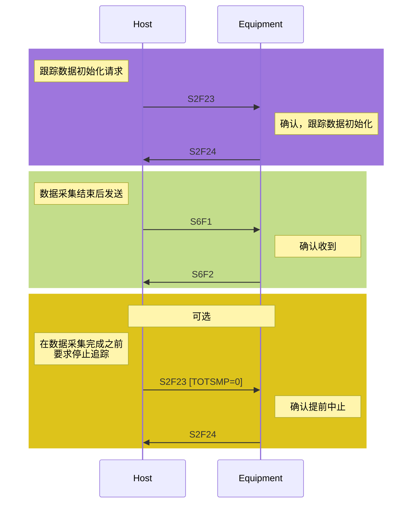

4.2.4 Limits Monitoring

This capability relates to the monitoring of selected equipment variables and has three primary aspects:
— Defines a standard set of monitoring zones and limits.
— Provides for reporting to the host when selected equipment variables transition between monitoring zones.
— Empowers the host to modify the values of the variable limit attributes for these same selected equipment variables.

> 限值监控
> 这种功能和设备变量的监控有关，主要在三个方面
>
> 1. 定义一套标准的监测和极限
> 2. 当选定的设备变量在检测区之间变化时，向主机报告
> 3. 授权主机位这些设备变量修改极限值

4.2.4.1 Purpose

The limits monitoring capability provides the host a means of monitoring equipment conditions by a flexible, efficient, and asynchronous method which is consistent across equipment. It eliminates the need for constant polling of equipment by the host for current status values. Further, this capability allows the host to implement changes in the monitoring range as needed. This capability has application to both production operation and diagnostic/testing scenarios, and it also has applicability to statistical process control.

> 限值监控功能为主机提供了一种通过灵活、高效和异步方法监控设备状况的手段，这种方法在不同设备之间是一致的。它消除了主机不断轮询设备以获取当前状态值的需要。此外，这种功能还允许主机根据需要更改监控范围。这种功能既适用于生产操作，也适用于诊断/测试方案，还适用于统计过程控制。

4.2.4.2  Definitions

LimitVariable — DVVAL containing the VID of a specific equipment variable for which a zone transition collection event has been generated.

> LimitVariable - DVVAL，包含已生成区段转换收集事件的特定设备变量的 VID。

EventLimit — DVVAL containing the LIMITID of the limit crossed by LimitVariable.

> EventLimit - DVVAL，包含 LimitVariable 所跨越限制的 LIMITID。

TransitionType — DVVAL which defines the direction of the zone transition which has occurred: 0 = transition from lower to upper zone, 1 = transition from upper to lower zone.

> TransitionType - DVVAL，定义已发生的区段转换的方向： 0 = 从下区过渡到上区，1 = 从上区过渡到下区。

Limit — Used in this section to represent the set of variable limit attributes that completely describe a variable monitoring “barrier.” The attributes include VID, Units, UPPERDB, LOWERDB, LIMITMAX, and LIMITMIN. In some contexts it may be interpreted more narrowly as the combination of UPPERDB and LOWERDB.

> Limit - 在本节中用于表示变量限制属性集，以完整描述变量监控 "障碍"。这些属性包括 VID、单位、UPPERDB、LOWERDB、LIMITMAX 和 LIMITMIN。在某些情况下，它可以更狭义地解释为 UPPERDB 和 LOWERDB 的组合。

LIMITIDn — Refers to the identifier of a specific limit (as defined by UPPERDB and LOWERDB) among the set of limits for a monitored equipment variable. LIMITIDs are consecutively numbered, beginning at one through the number of limits possible (seven minimum).

> LIMITIDn - 指受监控设备变量极限集合中特定极限的标识符（由 UPPERDB 和 LOWERDB 定义）。LIMITID 连续编号，从 1 开始，直到可能的限值数（最少 7 个）。

Monitoring Zone — A subset of the possible range of values for a variable of interest to the host. A single limit divides the range into two zones. Multiple limits may be combined to divide the range even further.

> Monitoring Zone - 主机感兴趣的变量可能取值范围的子集。单个限值将范围分为两个区。多个限值可以组合在一起，进一步划分范围。

Zone Transition — The movement of a variable value from one monitoring zone to another. This transition is a collection event and has a corresponding CEID.

> Zone Transition - 变量值从一个监控区域移动到另一个监控区域。这种转换是一个采集事件，并有一个相应的 CEID。

Deadband — An overlap of two zones implemented to prevent constant zone transitions by a variable sitting on or near a limit (i.e., “chattering”).

> Deadband - 两个区段的重叠，以防止变量在限值或接近限值时不断转换区段（即 "颤振"）。

UPPERDB — A variable limit attribute that defines the upper boundary of the deadband of a limit.  The value applies to a single limit (LIMITID) for a specified VID. Thus, UPPERDB and LOWERDB as a pair define a limit.

> UPPERDB - 变量限值属性，用于定义限值死区的上边界。该值适用于指定 VID 的单个限值 (LIMITID)。因此，UPPERDB 和 LOWERDB 作为一对定义了一个限值。

LOWERDB — A variable limit attribute that defines the lower boundary of the deadband of a limit.18 The value applies to a single limit (LIMITID) for a specified VID. Thus, UPPERDB and LOWERDB as a pair define a limit.

> LOWERDB - 变量限值属性，用于定义限值死区的下限18 。该值适用于指定 VID 的单个限值 (LIMITID)。因此，UPPERDB 和 LOWERDB 作为一对定义了一个限值。

UPPER ZONE — The range of values lying above a limit.

> UPPER ZONE（上限值）- 位于限值之上的数值范围。

LOWERZONE — The range of values lying below a limit.

> LOWERZONE （下限值） - 低于限值的数值范围。

LIMITMAX — The maximum value for any limits of a specific equipment variable. This value is set by the equipment manufacturer and typically coincides with the maximum value allowed for the monitored variable.

> LIMITMAX - 特定设备变量任何限制的最大值。该值由设备制造商设定，通常与监控变量允许的最大值一致。

LIMITMIN — The minimum value for any limits of a specific equipment variable.19 This value is set by the equipment manufacturer and typically coincides with the minimum value allowed for the monitored variable.

> LIMITMIN - 特定设备变量任何限值的最小值19 。该值由设备制造商设定，通常与监控变量允许的最小值一致。

Undefined — When used in reference to variable limits, it indicates that monitoring/reporting of zone transitions involving that particular limit are disabled.

> Undefined - 用于指变量限值时，表示禁用涉及该特定限值的区段转换监控/报告。

4.2.4.3 Description

The limits monitoring capability provides the host with a minimum of seven configurable limits or barriers that may be applied to selected equipment status variables (SV’s) of the types floating point, integer, and boolean. When one of these barriers is crossed, a collection event is generated to alert the host to a change in monitoring zone or state of the monitored variable. These seven limits may be combined in a variety of ways to match the needs of the host system. An illustration of a combination of five of the limits to provide one type of variable monitoring is shown in Figure 4.2.1.20 This section describes the key aspects of limits monitoring. Detailed implementation examples of limits monitoring are provided as Application Note A.7.

> 限值监控功能可为主机提供至少七个可配置的限值或障碍，这些限值或障碍可应用于浮点、整数和布尔类型的选定设备状态变量 (SV)。当越过其中一个障碍时，就会生成一个收集事件，提醒主机监控区域或被监控变量的状态发生变化。图 4.2.1 举例说明了五种限值的组合，以提供一种变量监控。限值监控的详细实施示例见应用说明 A.7。

NOTE 6: While the SEMI E5 standard allows SV’s to be lists, such variable lists are not allowed under this capability.

> 注 6： 虽然 SEMI E5 标准允许 SV 列表，但本功能不允许此类变量列表。

4.2.4.3.1 Monitoring Limit Characteristics — A limit is defined by a set of attributes that include the variable (VID) to which the limit corresponds, the units of that variable, the maximum and minimum possible values of the limit (LIMITMAX and LIMITMIN) and the specific borders of the limit (UPPERDB and LOWERDB). See Figure 4.2.2. There is a limitation to the values of UPPERDB and LOWERDB which may be stated as:

> 监控限值特征 - 限值由一组属性定义，其中包括限值对应的变量 (VID)、变量的单位、限值的最大值和最小值（LIMITMAX 和 LIMITMIN）以及限值的具体边界（UPPERDB 和 LOWERDB）。见图 4.2.2。UPPERDB 和 LOWERDB 的值有一个限制，可以表述为

LIMITMAX ≥ UPPERDB ≥ LOWERDB ≥ LIMITMIN

> LIMITMAX ≥ UPPERDB ≥ LOWERDB ≥ LIMITMIN

A limit divides the possible range of variable values into two parts, the upper zone and the lower zone. At any time, the monitored variable is considered to be in one and only one of these zones. However, as Figure 4.2.2 shows, these two zones have an area of overlap. This is called the deadband.

> 限值将变量值的可能范围分为两部分，即上限值和下限值。在任何时候，受监控变量都会被认为处于其中一个区域。但是，如图 4.2.2 所示，这两个区域有一个重叠区域。这就是所谓的死区。

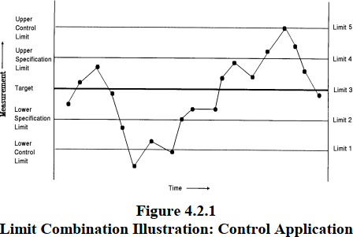

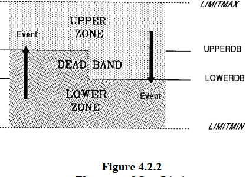

The deadband is a key concept of limits monitoring, especially for floating point variables. Its purpose is to prevent a phenomenon known as chattering — the repeated changing of zones due to small, rapid fluctuations in variable value while near the zone boundary. In practice, the value of a variable must reach the opposite boundary of the deadband before a zone transition can occur. Thus, if a variable’s value reaches the UPPERDB and transitions into the upper zone, it will not return to the lower zone until it falls back to the LOWERDB. The difference between UPPERDB and LOWERDB should always be greater than the typical amplitude of those fluctuations deemed to be insignificant. In some cases, the width of the deadband may set to zero (i.e., UPPERDB = LOWERDB). At first glance, this would seem to make indeterminate the current zone when an integer value sits on the limit. This is not the case, however, when movement of the value is considered. To illustrate, an example is given, assuming that UPPERDB = LOWERDB = 100. The list shows consecutive readings of the variable and the resultant zone:

> 死区是限值监控的一个关键概念，尤其适用于浮点变量。其目的是防止一种被称为 "颤振 "的现象，即在接近区域边界时，由于变量值的微小快速波动而导致区域反复变化。在实际操作中，变量值必须达到死区的相反边界，才能发生区段转换。因此，如果一个变量的值达到 UPPERDB 并过渡到上区，那么它在跌回 LOWERDB 之前不会返回下区。UPPERDB 和 LOWERDB 之间的差值应始终大于那些被视为不显著波动的典型振幅。在某些情况下，死区的宽度可能设置为零（即 UPPERDB = LOWERDB）。乍一看，当一个整数值位于限值上时，这似乎会使当前区段变得不确定。但是，如果考虑到数值的移动，情况就不是这样了。举例说明，假设 UPPERDB = LOWERDB = 100。列表显示了变量的连续读数和由此产生的区段：

99   Lower Zone (Initial Reading)
101  Upper Zone (Zone Transition)
100  Lower Zone (Zone Transition)
100  Lower Zone
99   Lower Zone
100  Upper Zone (Zone Transition)

Transition from one zone into another generates a collection event, as might be reported via S6,F11. The host has the option of receiving notification by enabling event reporting for the event. For each variable that has monitoring capability, one CEID is reserved to indicate zone transitions for that variable. To aid in the determination of the nature of a transition event, three DVVAL’s have been defined:

> 从一个区段进入另一个区段会产生一个收集事件，可通过 S6,F11 报告。主机可选择通过启用事件报告功能来接收通知。对于每个具有监控功能的变量，都保留了一个 CEID，用于指示该变量的区段转换。为了帮助确定过渡事件的性质，定义了三个 DVVAL：

LimitVariable — The VID of the monitored variable to which the collection event refers.

> LimitVariable - 收集事件指向的受监控变量的 VID

EventLimit — Contains the LIMITID of the limit reached or crossed by LimitVariable.

> EventLimit - 包含 LimitVariable 达到或超过的限制的 LIMITID。

TransitionType — Defines the direction of the zone transition which has occurred: 0 = transition from lower to upper zone, 1 = transition from upper to lower zone.

> TransitionType - 定义已发生的区段转换的方向： 0 = 从下区过渡到上区，1 = 从上区过渡到下区。

Sampling frequency is an important element of limits monitoring and should be considered during equipment specification. If changes in variable value are relatively fast compared to sampling frequency, it is possible for some zone transitions to be missed or for multiple zone transitions to occur between readings. Since it is possible for zone transitions to occur “simultaneously” or for limits to be identically defined, the DVVAL EventLimit has been defined to allow for a list of multiple zone transitions of a variable to be reported with a single collection event.

> 采样频率是限值监测的一个重要因素，应在设备规格制定过程中加以考虑。如果与采样频率相比，变量值的变化相对较快，则有可能漏掉某些区段的转换或在读数之间发生多个区段的转换。由于区域转换有可能 "同时 "发生，或者限值定义相同，因此定义了 DVVAL EventLimit（DVVAL 事件限值），以便通过单个采集事件报告变量的多个区域转换列表。

It also should be emphasized that a single CEID is used to report transitions in both directions across a limit. Thus, reporting for one direction but not the other cannot be configured.

> 还需要强调的是，单个 CEID 用于报告跨限值的双向转换。因此，不能只报告一个方向而不报告另一个方向。

The functionality of each limit for each variable can be described with the state model shown in Figure 4.2.3. Below, the three states are described more fully, followed by a table defining the transitions.

> 图 4.2.3 所示的状态模型可以描述每个变量的每个限值的功能。下面将对这三种状态进行更全面的描述，并用表格对转换进行定义。

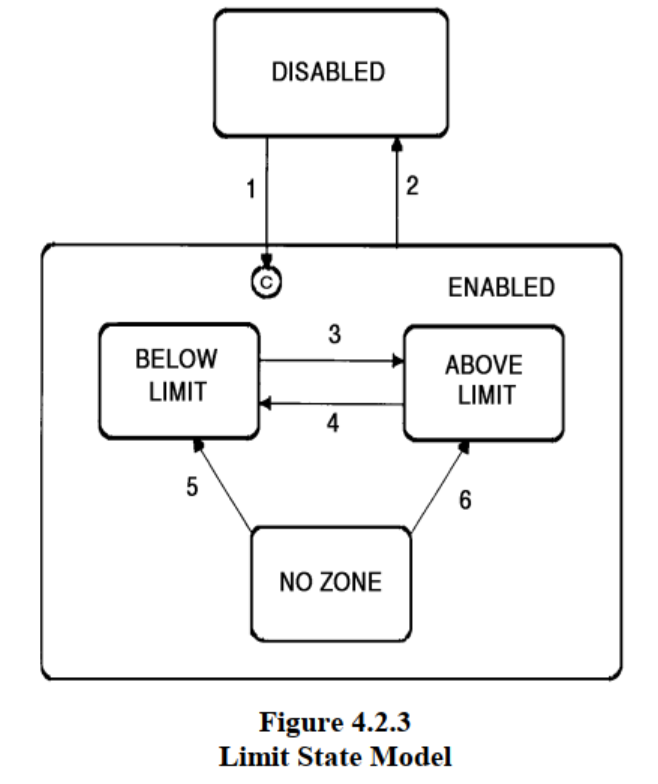

ABOVE LIMIT
A variable is considered to be above a limit when its value increases to equal or exceed the upper boundary of the deadband, UPPERDB. The significance attached to this state is a function of the host’s usage.

> 超出限值
> 当一个变量的值增加到等于或超过死区的上边界 UPPERDB 时，就认为该变量超过了限值。这种状态的重要性取决于主机的使用情况。

BELOW LIMIT
A variable is considered to be below a limit when its value decreases to equal or fall below the lower boundary of the deadband, LOWERDB. The significance attached to this state is a function of the host’s usage.

> 低于限值
> 当变量值下降到等于或低于死区下限 LOWERDB 时，该变量将被视为低于限值。这种状态的重要性取决于主机的使用情况。

NO ZONE
In some circumstances it is possible for the variable value to be in neither the upper zone nor the lower zone. This may occur upon definition of a new limit or upon equipment startup when the value of the variable lies in the deadband. In this case, the active state of the limit is considered to be NO ZONE. The limit shall remain in this state until the variable value reaches either boundary of the deadband.

> 无区域
> 在某些情况下，变量值可能既不在上区，也不在下区。这种情况可能发生在定义新限值或设备启动时，变量值位于死区。在这种情况下，限值的活动状态被视为 "无区域"。限值应保持此状态，直至变量值到达死区的任一边界。

4.2.4.3.2 Modification of Limit Values — Values for the monitoring limits on any monitored variable may be modified by the host using the message transaction S2,F45/F46 (Define Variable Limit Attributes). The equipment must reject any S2,F45 message which contains limit information which conflicts with the following rules:

> 4.2.4.3.2 修改限值 - 主机可通过报文事务 S2,F45/F46（定义变量限值属性）修改任何受监控变 量的监控限值。如果 S2,F45 报文中包含的限值信息与以下规则相冲突，设备必须予以拒绝：

- LIMITMAX≥UPPERDB≥LOWERDB≥LIMITMIN;
- If either UPPERDB or LOWERDB is defined, both must be defined; if either UPPERDB or LOWERDB is undefined, both must be undefined.

> - limitmax ≥ upperdb ≥ lowerdb ≥ limitmin；
> - 如果 UPPERDB 或 LOWERDB 已定义，则两者都必须定义；如果 UPPERDB 或 LOWERDB 未定义，则两者都必须未定义。

The first rule is defined and graphically depicted in Figure 4.2.2. The second rule refers to the host’s ability to turn any limit “on” or “off”. While a minimum of seven limits must be available for each monitored variable, it will be common for the host application to require less than seven or even none of the limits be used. The limits not needed can be disabled by leaving the values for UPPERDB and LOWERDB “undefined”. Limits may be disabled for a VID or for all monitored VIDs by using zero length lists in the S2,F45 message.

> 第一条规则的定义和图示见图 4.2.2。第二条规则是指主机可以 "打开 "或 "关闭 "任何限值。虽然每个受监控变量必须至少有七个限值，但主机应用程序通常会要求少于七个限值，甚至不使用任何限值。可以通过将 UPPERDB 和 LOWERDB 的值保留为 "未定义 "来禁用不需要的限制。通过在 S2,F45 报文中使用零长度列表，可以禁用一个 VID 或所有受监控 VID 的限制。

All monitored variables must be one of three types: integer, floating point, or Boolean. This may be accomplished by using the following formats: 11, 20, 3(), 4(), 5().

> 所有监控变量必须是三种类型之一：整数、浮点或布尔。这可以通过使用以下格式来实现： 11, 20, 3(), 4(), 5().

NOTE 7: The binary format is not allowed. If the ASCII format is used, the equipment shall perform a conversion into one of the numeric types before performing any value comparisons, both for limit validations and zone transitions.

> 注 7： 不允许使用二进制格式。如果使用 ASCII 格式，设备在进行任何数值比较（包括限值验证和区段转换）之前，应将其转换为数字类型之一。

4.2.4.3.3 Limit Values Request — The host may request the current limit values for a specified VID using the message transaction S2,F47/F48 (Variable Limit Attribute Request).

> 4.2.4.3.3 限值请求 - 主机可使用报文事务 S2,F47/F48（变量限值属性请求）请求指定 VID 的当前限值。

4.2.4.4  Requirements

- A minimum of seven limits per monitored variable must be available.
- One CEID per monitored variable must be supplied for zone transition reporting.
- All limit definitions must be kept in non-volatile storage.
- The equipment must enforce the limit validation rules defined above.
- The specification and documentation of which variables may be monitored with this capability is the responsibility of the equipment manufacturer based on the specific instance of equipment. This subject also may be addressed by equipment models of classes of semiconductor equipment.

> - 每个监控变量必须至少有七个限值。
> - 每个监控变量必须提供一个 CEID 用于区段转换报告。
> - 所有限值定义必须保存在非易失性存储器中。
> - 设备必须执行上述定义的限值验证规则。
> - 设备制造商有责任根据设备的具体情况，说明和记录哪些变量可使用此功能进行监控。半导体设备类别的设备模型也可解决这一问题。

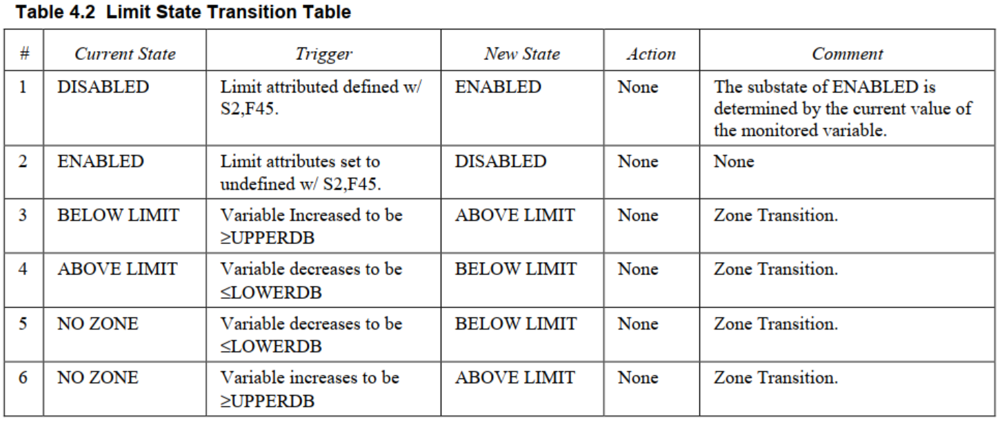
