# SEMI E37-0298 HIGH-SPEED SECS MESSAGE SERVICES (HSMS) GENERIC SERVICES

## 1. Purpose 目的

HSMS provides a means for independent manufacturers to produce implementations which can be connected and interoperate without requiring specific knowledge of one another.

> HSMS 为独立制造商提供了一种生产实现的手段，这些实现可以相互连接和互操作，而不需要彼此之间的特定知识。

HSMS is intended as an alternative to SEMI E4 (SECS-I) for applications where higher speed communication is needed or when a simple point-to-point topology is insufficient. SEMI E4 (SECS-I) can still be used in applications where these and other attributes of HSMS are not required.

> HSMS 是 SEMI E4(SECS-I)的替代品，用于需要更高速通信或简单点对点拓扑不足的应用。SEMI E4(SECS-I)仍然可以用于不需要 HSMS 的这些属性和其他属性的应用程序中。

HSMS is also intended as an alternative to SEMI E13 (SECS Message Services) for applications where TCP/ IP is preferred over OSI.

> HSMS 还可以作为 SEMI E13(SECS 消息服务)的替代品，用于 TCP/IP 优于 OSI 的应用程序。

It is intended that HSMS be supplemented by subsidiary standards which further specify details of its use or impose restrictions on its use in particular application domains.

> 目的是通过附属标准对 HSMS 进行补充，进一步详细说明其使用情况，或对其在特定应用领域的使用施加限制。

## 2. Scope 范围

High-Speed SECS Message Services (HSMS) defines a communication interface suitable for the exchange of messages between computers in a semiconductor factory.

> 高速SECS消息服务(HSMS)定义了一种适合于半导体工厂中计算机之间交换消息的通信接口。

## 3. Referenced Documents

SEMI标准参考了
SEMI E4  — SEMI Equipment Communication Standard 1 — Message Transport (SECS-I)
SEMI E5  — SEMI Equipment Communication Standard 2 — Message Content (SECS-II)

## 4. Terminology 术语

API — Application Program Interface. In the case of TCP/IP, a set of programming conventions used by an application program to prepare for or invoke TCP/IP capabilities.

> API：应用程序接口。在TCP/IP下，应用程序使用的一组编程约定，用于调试TCP/IP功能

communication failure — A failure in the communication link resulting from a transition to the NOT CONNECTED state from the SELECTED state. (See Section 9.)

> communication failure：通讯故障，特指从SELECTED状态转换到NOT CONNECTED状态而导致的通讯故障。

confirmed service (HSMS) — An HSMS service requested by sending a message from the initiator to the responding entity which requires that completion of the service be indicated by a response message from the responding entity to the initiator.

> confirmed service(HSMS)：确认服务，表示通过从originator向interpreter发送request消息的HSMS服务，该消息要求interpreter向originator发送响应的消息后才算结束

connection — A logical linkage established on a TCP/ IP LAN between two entities for the purposes of exchanging messages.

> connection：在TCP/IP局域网上两个实体为交换消息而建立的一种逻辑链路。

control message — An HSMS message used for the management of HSMS sessions between two entities.

> control message：一种用于管理两个实体之间的HSMS会话的HSMS消息。

data message — An HSMS message used for commu- nication of application-specific data within an HSMS session. A Data Message can be a primary message or a Reply Message.

> data message：用于在HSMS会话中通信应用程序特定数据的HSMS消息。数据消息可以是主消息或回复消息。

entity — An application program associated with an endpoint of a TCP/IP connection.

> entity：通过TCP/IP连接的应用程序

header — A 10-byte data element preceding every HSMS message.

> header：在每个HSMS消息之前的一个10字节的数据单元。

initiator (HSMS) — The entity requesting an HSMS service. The initiator requests the service by sending an appropriate HSMS message.

> initiator：请求HSMS服务的应用程序

IP Address — Internet Protocol Address. A logical address which uniquely identifies a particular attach- ment to a TCP/IP network.

> IP Address：Internet协议地址。唯一标识TCP/IP网络特定连接的逻辑地址。

local entity — Relative to a particular end point of a connection, the local entity is that entity associated with that endpoint.
local entity：本地实体，相对于远程实体。

message — A complete unit of communication in one direction.  An HSMS Message consists of the Message Length, Message Header, and the Message Text. An HSMS Message can be a Data Message or a Control Message.

message length — A 4-byte unsigned integer field specifying the length of a message in bytes.

open transaction — A transaction in progress.

port — An endpoint of a TCP/IP connection whose complete network address is specified by an IP Address and TCP/IP Port number.

port number — (or TCP port number).  The address of a port within an attachment to a TCP/IP network which can serve as an endpoint of a TCP/IP connection.

primary message — An HSMS Data Message with an odd numbered Function.  Also, the first message of a data transaction.

published port — A TCP/IP IP Address and Port num- ber associated with a particular entity (server) which that entity intends to use for receiving TCP/IP connec- tion requests. An entity's published port must be known by remote entities intending to initiate connec- tions.

receiver — The HSMS Entity receiving a message.

remote entity — Relative to a particular endpoint of a connection, the remote entity is the entity associated with the opposite endpoint of the connection.

reply — An HSMS Data Message with an even-num- bered function. Also, the appropriate response to a Pri- mary HSMS Data Message.

responding entity (HSMS) — The provider of an HSMS service. The responding entity receives a mes- sage from an initiator requesting the service. In the event of a confirmed service, the responding entity indicates completion of the requested service by send- ing an appropriate HSMS response message to the ini- tiator of the request. In an unconfirmed service, the responding entity does not send a response message.

session — A relationship established between two entities for the purpose of exchanging HSMS messages.

session entity — An entity participating in an HSMS session.

session ID — A 16-bit unsigned integer which identi- fies a particular session between particular session entities.

stream (TCP/IP) — A sequence of bytes presented at one end of a TCP/IP connection for delivery to the other end. TCP/IP guarantees that the delivered sequence of bytes matches the presented stream. HSMS subdivides a stream into blocks of contiguous bytes - messages.

T3 — Reply timeout in the HSMS protocol.

T5 — Connect Separation Timeout in the HSMS protocol used to prevent excessive TCP/IP connect activity by providing a minimum time between the breaking, by an entity, of a TCP/IP connection or a failed attempt to establish one, and the attempt, by that same entity, to initiate a new TCP/IP connection.

T6 — Control Timeout in the HSMS protocol which defines the maximum time an HSMS control transac- tion can remain open before a communications failure is considered to have occurred. A transaction is consid- ered open from the time the initiator sends the required request message until the response message is received.

T7 — Connection Idle Timeout in the HSMS protocol which defines the maximum amount of time which may transpire between the formation of a TCP/IP con- nection and the use of that connection for HSMS com- munications before a communications failure is considered to have occurred.

T8 —  Network Intercharacter Timeout in the HSMS protocol which defines the maximum amount of time which may transpire between the receipt of any two successive bytes of a complete HSMS message before a communications failure is considered to have occurred.

TCP/IP — Transmission Control Protocol/Internet Protocol. A method of communications which provides reliable, connection-oriented message exchange between computers within a network.

TLI — Transport Level Interface. One particular API provided by certain implementations of TCP/IP which provides a transport protocol and operating system independent definition of the use of any Transport Level protocol.

transaction — A primary message and its associated Reply message, if required. Also, an HSMS Control Message of the request (.req) type, and its response Control Message (.rsp), if required.

unconfirmed service (HSMS) — An HSMS service requested by sending a message from the initiator to the responding entity which requires no indication of completion from the responding entity.

## 5. HSMS Overview and State Diagram HSMS概述和状态图

High-Speed SECS Message Services (HSMS) defines a communication interface suitable for the exchange of messages between computers in a semiconductor fac- tory using a TCP/IP environment. HSMS uses TCP/IP stream support, which provides reliable two way simultaneous transmission of streams of contiguous bytes. It can be used as a replacement for SECS-I communication as well as other more advanced communi- cations environments.

> HSMS定义了一种通信接口，基于TCP/IP通讯，用于半导体工厂计算机之间交换信息。

The procedure for HSMS communications parallels the more familiar SECS-I communications it replaces. The following steps are followed for any communica- tions (HSMS or otherwise):

> HSMS通信程序与SECS-I通讯程序类似，按照如下步骤进行通讯：

1. Obtain a communications link between two entities. In SECS-I, this is the RS232 wire physically connecting host and equipment. In HSMS, the link is a TCP/IP connection obtained by the standard TCP/IP connect procedure. Note that the abstract term "entity" is used instead of "host" or "equip- ment." This is because, while HSMS is used for SECS-I replacement, it has more general applica- tions as well. In a SECS-I replacement application, the "host" is an "entity" and the "equipment" is an "entity."

   > 建立两个entity之间的通信链路（局域网）。这里之所以使用术语entity而非equipment或者host，是因为HSMS有更广泛的应用，本质上equipment和host就是一个entity
   >
2. Establish the application protocol conventions to be used for exchanging data messages between two entities. For SECS-I, this step is implicit in the fact that semiconductor equipment is physically con- nected on the two ends of the wire: the protocol is SECS-II. In the case of HSMS, the communications link is a dynamically established TCP/IP connection on a physical link which may be shared with many other TCP/IP connections using protocols other than HSMS or connections using non TCP/IP protocols. HSMS adds a message exchange (called the Select procedure) which is used to confirm to both entities that the particular TCP/IP connection is to be used exlusively for HSMS communications.

   > 建立用于在两个entity之间的Socket通讯。除了建立Socket通讯，HSMS还增加了了一个消息交换(称为Select过程) ，用于向两个entity确认特定的socket连接将专门用于 HSMS 通信。
   >
3. Exchange Data. This is the normal intended purpose of the communications link. In both SECS-I and HSMS, the procedure is to exchange SECS-II encoded messages for the control of semiconductor equipment and/or processes. Data exchange nor- mally continues until one or both of the entities are taken off-line for equipment-specific purposes, such as maintenance.

   > 交换数据，这也是建立通信连接的目的。在 SECS-I 和 HSMS 中，程序是交换 SECS-II 编码的消息以控制半导体设备和/或工艺。数据交换正常情况下继续进行，直到一个或两个实体为特定设备目的(如维护)脱机。
   >
4. Formally end communications. In SECS-I, there is no formal requirement here; the equipment to be taken off-line stops communicating. In HSMS, a message exchange (either the “bilat eral” Deselect procedure or the “unilateral” separate procedure) is used for both parties to confirm that the TCP/IP connection is no longer needed for HSMS communications.

   > 正式结束通讯。在 SECS-I 中，这里没有正式的要求; 要离线的设备停止通信。在 HSMS 中，双方使用消息交换(“双边”取消选择程序或“单边”分离速率程序)来确认 HSMS 通信不再需要 TCP/IP 连接。
   >
5. Break the communications link. In SECS-I, this is done by physically unplugging the host or equip- ment from the communications cable, which only occurs during repair or physical reconfiguration of the factory network environment. In HSMS, since it uses the dynamic connection environment of TCP/IP, the TCP/IP connection is logically broken via a release or a disconnect procedure without any physical disconnect from the network medium.

   > 切断通讯。在 SECS-I 中，这是通过将主机或设备从通信电缆中物理拔出来完成的，这只在工厂网络环境的维修或物理重新配置期间才会发生。在 HSMS 中，由于使用 TCP/IP 的动态连接环境，所以 TCP/IP 连接通过释放或断开过程在逻辑上中断，而不与网络介质发生任何物理断开。
   >

Two additional procedures, of a diagnostic nature, are supported in HSMS, which are generally not required by a simple SECS-I link or a SECS-I direct replacement. These follow:

> HSMS 支持另外两个诊断性质的程序，这些程序通常不需要简单的 SECS-I 链接或 SECS-I 直接替换。以下是:

1. Linktest. This procedure provides a simple confirmation of connection integrity.

   > 过程提供连接完整性的简单确认。
   >
2. Reject. Because HSMS is intended to be extended to protocols other than just SECS-II (by means of subsidiary standards), it is possible that two entities can be connected (due to a configuration error) which use incompatible subsidiary standards. Also, during initial implementation, incorrect message types may be sent, or they may be sent out of order due to software bugs. The reject procedure is used to indicate such an occurrence.

   > 因为 HSMS 的目的是扩展到不仅仅是 SECS-II (通过附属标准)的协议，所以有可能连接两个使用不兼容附属标准的实体(由于配置错误)。此外，在最初的实现过程中，可能会发送不正确的消息类型，或者由于软件错误而发送错误的消息类型。reject过程用于指示这种情况。
   >

### 5.1 HSMS Connection State Diagram

The HSMS state machine is illustrated in the diagram below. The behavior described in this diagram defines the basic requirements of HSMS: subsidiary standards may further extend these or other states.

> HSMS 状态机如下图所示。此图中描述的行为定义了 HSMS 的基本需求: 附属标准可以进一步扩展这些或其他状态。

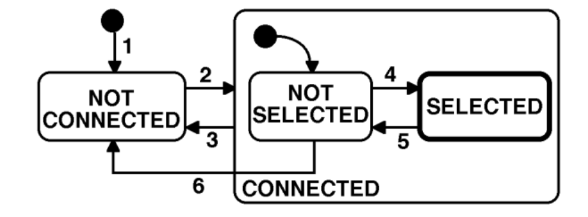

### 5.2 State Descriptions

5.2.1   NOT CONNECTED — The entity is ready to listen for or initiate TCP/IP connections but either has not yet established any connections or all previously established TCP/IP connections have been terminated.

> 该entity已准备好监听或启动TCP/IP连接。此时要么尚未建立任何连接，要么以前建立的所有TCP/IP连接都已断开。

5.2.2 CONNECTED — A TCP/IP connection has been established. This state has two substates, NOT SELECTED and SELECTED.

> 已建立TCP/IP连接。此状态有两个子节点，NOT SELECTED和SELECTED。

5.2.2.1   NOT SELECTED — A substate of CONNECTED in which no HSMS session has been established or any previously established HSMS session has ended.

> CONNECTED的子状态，该状态下没有建立任何HSMS会话或者之前建立的HSMS会话已经结束。

5.2.2.2   SELECTED — A substate of CONNECTED in which at least one HSMS session has been established. This is the normal "operating" state of HSMS: data messages may be exchanged in this state. It is highlighted by a heavy outline in the state diagram.

> CONNECTED的子状态，至少建立了一个HSMS会话。在这种状态下，数据消息可以进行交换。

### 5.3 状态过渡

1. 搭建好entity之间的局域网后，则进入NOT CONNECTED状态
2. 当前状态为NOT CONNECTED状态时，建立了TCP/IP通讯后，则进入CONNECTED的NOT SELECTED子状态
3. 当前状态为CONNECTED时（无所谓子状态）断开TCP/IP连接后则进入NOT CONNECTED状态
4. 当前状态为NOT SELECTED时，成功完成了HSMS的select流程，则进入了SELECTED状态
5. 当前状态为SELECTED时，成功完成了deselect或者separate流程，则进入了NOT SELECTED状态
6. 当前状态为NOT SELECTED状态时，在执行select流程过程中出现了T7超时，则进入NOT CORRECTED状态

## 6. TCP/IP的使用

### 6.1 TCP/IP API

The specification of a required TCP Application Program Interface (API) for use in imple- mentations is outside the scope of HSMS. A given HSMS implementation may use any TCP/IP API — sockets, TLI (Transport Layer Interface), etc. — appropriate to the intended hardware and software platform, as long as it provides interoperable TCP/IP streams protocol on the network.

> 本文档并不会介绍怎么去实现TCP/IP的API，而是使用现成的socket

The appendix contains examples of the TCP/IP procedures referenced in this standard and sample scenarios using both the TLI (POSIX standard 1003.12) and the popular BSD socket model for TCP/IP communication.

### 6.2 TCP/IP Network Addressing Conventions TCP/IP网络寻址约定

IP Address

Each physical TCP/IP connection to a given Local Area Network (LAN) must have a unique IP Address. IP Addresses must be assignable at installation time, and an HSMS implementation cannot select a fixed IP Address. A typical IP Address is 192.9.200.1.

> 给定局域网的每个物理连接都必须具有唯一的IP地址。这部分内容在建立TCP/IP连接部分完成，HSMS协议里不包含选择某个IP地址的方法。一个典型的IP地址为192.168.0.1。

TCP Port Numbers

A TCP Port Number can be considered as an extension of the IP Address.

> TCP端口号可以视为IP地址的扩展

HSMS implementations should allow configuring TCP Port to the full range of the TCP/IP implementation used. A typical TCP Port Number is 5000.

> HSMS协议支持TCP/IP协议支持的所有的端口。一个典型的端口为5000。

### 6.3 Establishing a TCP/IP Connection 建立以一个TCP/IP连接

Connect Modes

The procedures for establishing a TCP/IP connection are defined in RFC 793. However, not all the procedures defined by RFC 793 are supported by commonly available APIs. In particular, while RFC 793 permits both entities to initiate the connection simultaneously, this feature is rarely supported in available APIs. Therefore, HSMS restricts an entity to one of the following modes:

> 建立TCP/IP连接的过程在此不赘述，可以参考官方文档。通常TCP/IP分为服务器和客户端，基于这种模式HSMS将entity定义为下面两种模式：

- Passive Mode： The Passive mode is used when the local entity listens for and accepts a connect procedure initiated by the Remote Entity.

  > 当local entity接收由remote entity发起的连接时，使用被动模式（相当于服务器）
  >
- Active Mode：The Active mode is used when the connect procedure is initiated by the Local Entity.

  > 当local entity发起连接时，使用主动模式（相当于客户端）
  >

The appendix provides an example of how an entity may operate alternately in the active and passive modes to achieve greater flexibility in establishing communications.

> 附录提供了一个实体如何以主动和被动方式交替运作的实例，以便在建立通信方面实现更大的灵活性

Passive Mode Connect Procedure 被动模式连接过程

The procedure followed by the Passive Local Entity is defined in RFC 793.  It is summarized as follows:

> 被动模式的local entity连接过程总结如下：

1. Obtain a connection endpoint and bind it to a published port.

   > 建立socket并绑定端口
   >
2. Listen for an incoming connect request to the published port from a remote entity.

   > 监听remote entity发起的连接请求
   >
3. Upon receipt of a connect request, acknowledge it and indicate acceptance of the connection. At this point, the connect procedure has completed suc- cessfully, and the CONNECTED state is entered (Section 5).

   > 接收到连接请求后，确认该请求并接收连接。此时连接过程已经完成，并进入CONNECTED状态
   >

These procedures are carried out through the API of the local entity's implementation of TCP/IP. The appendices provide the API-specific procedures for the above steps using both TLI and BSD.

> 这个过程是通过local entity的TCP/IP协议提供的API执行的。

Note: A failure may occur during the above steps. The reason for failure may be local entity-specific or may be due to a lack of any connect request after a local entity-specific timeout. The action to be taken (for example: return to step 1 to retry) is a local entity-spe- cific issue.

> 备注：上述步骤可能会失败。失败的原因可能是因为local entiry，也可能是因为remote entity。

Note: See Section 9, Special Considerations, for issues relating to multiple connection requests to the same passive mode entity.

> 备注：有关于同一个处于被动模式下的local entity如何处理多个remote entity请求的问题，参考第九章“特殊注意事项”

Active Mode Connect Procedure 主动模式连接过程
The procedure followed by the Active Local Entity is defined in RFC 793. It is summarized as follows:

> 被动模式的local entity连接过程总结如下：

1. Obtain a connection endpoint.

   > 新建socket
   >
2. Initiate a connection to the published port of a passive mode remote entity.

   > 连接被动模式的remote entity的对应端口
   >
3. Wait for the receipt of the acknowledge and the acceptance of the connect request from the remote entity. Receipt of the acceptance from the remote entity indicates successful completion of the connect procedure, and the CONNECTED state is entered (Section 5).

   > 等待从remote entity收到确认并且接受了连接请求，进入CONNECTED状态
   >

These procedures are carried out through the API of the local entity's implementation of TCP/IP. The appendix provides the API-specific procedures for the above steps using both TLI and BSD.

> 该过程是通过local entity的TCP/IP协议提供的API来执行的。

Note: A failure may occur during the above steps. The reason for failure may be local entity-specific or may be due to a lack of any accept message after a local entity-specific timeout. The action to be taken is a local entity-specific issue. If, however, the local entity intends to retry the connection, it should do so subject to the T5 connect separation timeout (see "Special Considerations").

> 注意：上述步骤可能会失败。如果local remote打算重新连接，应该在T5连接分离超时的情况下重新连接。

### 6.4 Terminating a TCP/IP Connection 中止TCP/IP的连接

Connection termination is the logical inverse of Connection estab- lishment. From the Local Entity's perspective, a TCP/ IP connection may be broken at any time. However, HSMS only permits termination of the connection when the connection is in the NOT SELECTED substate of the CONNECTED state.

> 从local entity的角度来说，TCP/IP的连接随时可能终端。但是HSMS协议只允许在连接处于CONNECTED状态的NOT SELECTED子状态时中止连接

The procedures for termination of a connection are defined in RFC 793. Either entity may initiate termination of the connection. The NOT CONNECTED state is entered, indicating the end of HSMS communications. The appendix illustrates the procedures for both release and disconnect using the TLI and BSD APIs.

> 任何entity都可以启动连接中止。进入NOT CONNECTED状态表示HSMS通信结束。

## 7 HSMS Message Exchange Procedures

HSMS defines the procedures for all message exchange between entities across the TCP/IP connection established according to the procedures in the previous section. As explained in the overview, once the connection is established, the two entities establish HSMS communications with the Select procedure. Then data messages may be exchanged in either direction at any time. When the entities wish to end HSMS communications, the Deselect or Separate procedure is used to end HSMS communications.

> HSMS协议定义了entity之间所有信息交换的过，前提是建立了TCP/IP连接。一旦TCP/IP连接建立，两个entity将通过select过程建立HSMS通信。然后数据可以在任何时候向任何一方交换。当entity希望结束HSMS通信时，使用deselect过程或者separate过程。

### 7.1 Sending and Receiving HSMS Message

All HSMS procedures involve the exchange of HSMS messages.  These messages are sent and received as TCP/IP streams using the previously established TCP/ IP connection at standard priority.  In particular, the use of "Urgent" data is not supported under HSMS (see RFC 793 for more information on send and receive procedures).

> 所有HSMS操作都涉及到HSMS Message的交换。这些Message通过之前建立的TCP/IP连接进行接收和发送。

The appendix gives examples of sending and receiving HSMS messages using both TLI and BSD socket APIs.

### 7.2 Select Procedure

> select流程

The Select procedure is used to establish HSMS communications on a TCP/IP connection using the Select.req and Select.rsp messages in a control transaction.

> select过程是一个control类型的事务（message 分为 control message 和data message），在TCP/IP连接的基础上，使用Select.req和Select.rsp消息建立HSMS通讯。

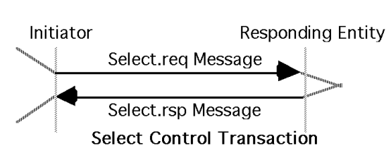

Although HSMS permits Select at any time in the CONNECTED state, subsidiary standards may further require the connection to be in the NOT SELECTED substate (see "Special Considerations").

> 虽然HSMS在CONNECTED状态的任何时候都允许进行Select，但是一些子标准可能进一步要求处于NOT SELECTED子状态。

7.2.1 Initiator Procedure select发起方的流程
The procedure followed by the initiator is as follows.

> 初始化流程如下所示：

1. The initiator of the select procedure sends the Select.req message to the responding entity.

   > select流程的发起方将select.rsq消息发给响应方
   >
2. If the initiator receives a Select.rsp with a Select Status of 0, The HSMS Select procedure completes successfully and the SELECTED state is entered (see Section 5).

   > 如果后续发起者收到了响应代码为0的select.rsp消息，则select流程结束，并进入SELECTED状态
   >
3. If the initiator receives a Select.rsp with a non-zero Select Status, the Select completes unsuccessfully (no state transitions).

   > 如果后续发起者收到了响应代码非0的select.rsp消息，则select流程结束，没有状态转换，表示select失败
   >
4. If the T6 timeout expires in the initiator before receipt of a Select.rsp, it is considered a communications failure (see "Special Considerations").

   > 如果在T6超时之前没有接收到select.rsp，则认为是communication failure，此时应转换到NOT CONNECTED状态
   >

7.2.2 Responding Entity Procedure select响应方的流程

1. The responding entity receives the Select.req.

   > 响应方接收到select.req
   >
2. If the responding entity is able to accept the select, it transmits the Select.rsp with a Select Status of 0. The HSMS Select Procedure for the responding entity is successfully completed, and the SELECTED state is entered (see Section 5).

   > 如果响应方决定接受select，会以响应代码为0的select.rsp消息进行回复。此时响应方完成了select过程，并进入SELECTED状态
   >
3. If the responding entity is unable to permit the select, it transmits the Select.rsp with a non-zero Select Status. The HSMS Select Procedure for the responding entity completes unsuccessfully (no state transitions).

   > 如果响应方不接收select，应发以响应代码非0的select.rsp的消息进行回复。响应方的HSMS的select结束，没有状态转换。
   >

7.2.3 Simultaneous Select Procedures 双方同时select的过程
If the subsidiary standards do not restrict the use of the Select, it is possible that both entities simultaneously initiate Select Procedures with identical SessionID’s. In such a case, each entity will accept the other entity's select request by responding with a Select.rsp.

> 如果附属标准不限制select的使用，那么双方可能同时发起具有相同session id的select过程。在这种情况下，双方分别使用select.rsp来响应另一方。

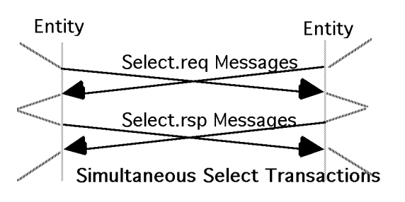

### 7.3 Data Procedure 数据交换过程

HSMS data messages may be initiated by either entity as long as the connection is in the SELECTED state. Receipt of a data message when not in the SELECTED state will result in a reject procedure (see Section 7.7).

> 只要HSMS连接处于SELECTED状态，HSMS data message就可以由任何一方发起。如果不处于SELECTED状态时接收到了data message则会触发reject流程。

Data messages may be further defined as part of a data transaction as either a "Primary" or "Reply" data message. In a data transaction, the initiator of the transaction sends a primary message to the responding entity. If the primary message indicates that a reply is expected, a Reply message is sent by the responding entity in response to the Primary.

> data message进一步可以区分为primary message或者secondary message。在data transaction中，事务的发起方向响应方发送主消息。如果primary message要求回复，则响应方会向primary message的发起方发送一条secondary message

The following types of Data Transactions are supported:

> HSMS协议支持如下几种数据事务

1. Primary Message with reply expected and the associated Reply Message.

   > 要求回复的主消息和相应的次消息
   >
2. Primary Message with no reply expected.

   > 不要求回复的主消息
   >

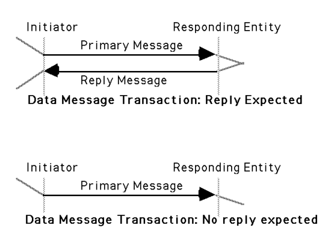

The specific procedures for these transactions are determined by the application layer and are subject to other standards (for example, E5 and E30 for GEM equipment using SECS-II encoded messages).

> 事务的具体流程由TCP/IP决定，并遵循其他标准（如使用SECS-II编码消息的GEM设备E5标准和E30标准）

The applicable upper layer standard is identified by the message type. The type is determined from the specific format defined in Section 8. The normal type for HSMS messages is SECS-II text. Also refer to "Special Considerations" concerning the T3 Reply Timeout.

> 另外还需要进一步定义消息类型，该类型参考第八章。HSMS消息通常是SECS-II格式的文本。另外data transaction的超时使用T3超时。

### 7.4 Deselect Procedure

The Deselect procedure is used to provide a graceful end to HSMS communication for an entity prior to breaking the TCP/IP connection. HSMS requires that the connection be in the SELECTED state. The procedure is as follows.
> deselect流程用于在TCP/IP连接中断之前提供一个优雅的方式断开HSMS连接。要求HSMS连接处于SELECTED状态。

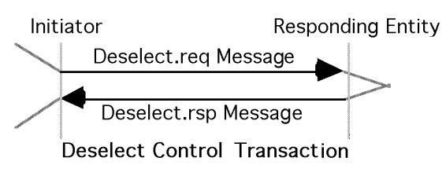

7.4.1 Initiator Procedure 发起方的流程

1. The initiator of the Deselect procedure sends the Deselect.req message to the responding entity.

   > 发起方发送deselect.req消息
   >
2. If the initiator receives a Deselect.rsp with a Deselect Status of 0, its Deselect procedure terminates successfully. The NOT SELECTED state is entered (see Section 5).

   > 如果发起方接收到响应代码为0的deselect.rsq消息，则deselect过程成功结束，进入NOT SELECTED状态
   >
3. If the initiator receives a Deselect.rsp with a non-zero Deselect Status, its Deselect procedure terminates unsuccessfully. No state change occurs.

   > 如果发起方接收到响应代码非0的deselect.rsq消息，则deselect结束，但是状态不改变
   >
4. If the T6 timeout expires in the initiator before receipt of a Deselect.rsp, it is considered a communications failure (see "Special Considerations").

   > 如果发起方在T6超时之前还没有收到deselect.rsq，则认为communication failure，应进入NOT CONNECTED状态
   >

7.4.2   Responding Entity Procedure 响应方的流程

1. The responding entity receives the Deselect.req message.

   > 响应方接收到deselect.req消息
   >
2. If the responding entity is in the SELECTED state, and if it is able to permit the Deselect, it responds using the Deselect.rsp with a zero response code. The responding entity's Deselect procedure com- pletes successfully.  The NOT SELECTED state is entered (see Section 5).

   > 如果响应方处于SELECTED状态，且接收deselect，则将回复deselect.rsp，响应代码为0。响应方deselect流程结束，进入NOT SELECTED状态。
   >
3. If the responding entity is unable to permit the Deselect, either because it is not in the SELECTED state or because local conditions do not permit the Deselect, it responds using the Deselect.rsp with a non-zero response code. The responding entity's Deselect procedure terminates unsuccessfully.  No state change occurs.

   > 如果响应方不处于SELECTED状态，或者不接受deselect，亦或者是因为某些其他原因无法deselect，那么就以非0代码的deselect.rsp进行回复。响应方的deselect过程结束，状态不更改。
   >

7.4.3   Simultaneous Deselect Procedures 双方同时发起deselect的流程

If the subsidiary standards do not restrict the use of the Deselect, it is possible that both entities simultaneously initiate Deselect Procedures with identical SessionID’s. In such a case, each entity will accept the other entity's Deselect request by responding with the deselect.rsp.

> 如果附属标准不限制deselect的使用，那么双方可能同时发起具有相同session id的deselect过程。在这种情况下，双方分别使用deselect.rsp响应另一方。

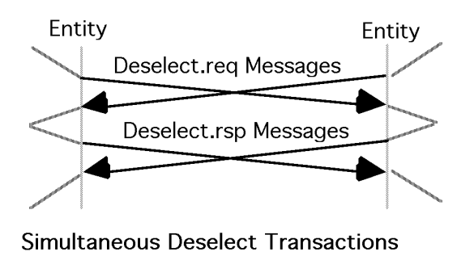

### 7.5 LinkTest Procedure LinkTest流程（心跳包）

The Linktest is used to determine the operational integrity of TCP/IP and HSMS communications. Its use is valid anytime in the CONNECTED state.

> linktest用于确认TCP/IP和HSMS通信的完整性。在CONNECTED状态下（无论子状态）都可以使用。

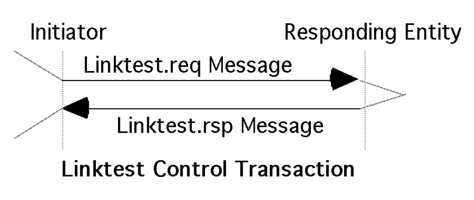

7.5.1   Initiator Procedure 发起方流程

1. The initiator of the Linktest procedure sends the Linktest.req message to the responding entity.

   > Linktest过程的发起方发送Linktest.req消息
   >
2. If the initiator receives a Linktest.rsp within the T6 timeout, the Linktest is successfully completed.

   > 如果发起方在T6超时时间之前收到一个Linktest.rsp，Linktest成功完成
   >
3. If the T6 timeout expires in the initiator before receipt of a Linktest.rsp, it is considered a communications failure (see "Special Considerations").

   > 如果发起方在T6超时后未收到Linktest.rsp，则触发communication failure，应进入NOT CONNECTED状态
   >

7.5.2   Responding Entity Procedure 响应方流程

1. The responding entity receives the Linktest.req from the initiator.

   > 响应方接收到Linktest.req消息
   >
2. The responding entity sends a Linktest.rsp.

   > 响应方发送一个Linktest.rsp
   >

### 7.6   Separate Procedure Separate 流程，单方面强制断开

The Separate procedure is used to abruptly terminate HSMS communication for an entity prior to breaking the TCP/IP Connection. HSMS requires that the connection be in the SELECTED state when using Separate. The responding entity does not send a response and is required to terminate communications regardless of its local state. The procedure is as follows.

> separate流程用于在终端TCP/IP之前突然终止HSMS通信。在使用separate时，要处于SELECTED状态。响应方不发送任何响应，并且需要立即终止通信，不管当前状态是什么。

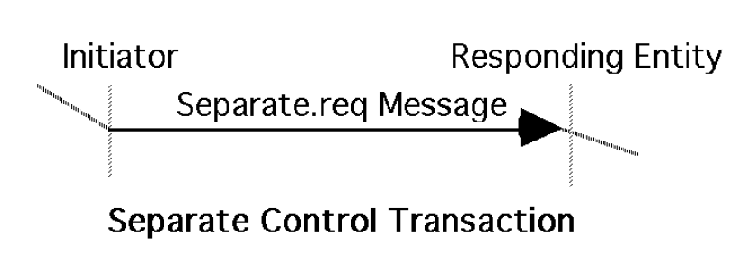

7.6.1   Initiator Procedure

> 发起方流程

1. The initiator of the select procedure sends the Separate.req message to the responding entity. The initiator's Separate procedure completes successfully.The NOT SELECTED state is entered (see Section 5).
   > select过程的发起方发送separate.req消息，separate过程结束，进入NOT SELECTED状态
   >

7.6.2   Responding Entity Procedure

> 响应方流程

1. The responding entity receives the Separate.req from the initiator.

   > 响应方接收separate.req消息
   >
2. If the responding entity is in the SELECTED state, its Separate procedure completes successfully.

   > 如果响应方在SELECTED状态，那么separate成功结束
   >
3. If the responding entity is not in the SELECTED state, the Separate.req is ignored.

   > 如果响应方不在SELECTED状态，则忽略separate.req消息
   >

### 7.7   Reject Procedure reject流程

The Reject procedure is used in response to an otherwise valid HSMS message received in an inappropriate context. Supporting the reject procedure can provide useful diagnostic infor- mation during the development of a distributed appli- cation using HSMS.  The procedure is as follows:

> reject过程用于在非正常状态下响应正常的HSMS消息，这可以提供有用的诊断信息

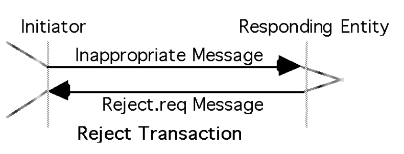

7.7.1   Initiator (Sender of Inappropriate Message) Procedure \

> 发起方流程（这里的发起方指的是正常HSMS消息的发起方）

1. The initiator of the inappropriate message, upon receiving the Reject.req, takes appropriate action (local entity-specific).
   > 发起方在收到reject.req后，应采取适当的操作
   >

7.7.2   Responding Entity Procedure

> 响应方的流程

1. The entity receiving the inappropriate message responds with a Reject.req message.
   > 在非正常状态下收到了正常的HSMS消息的响应方，要使用reject.req消息进行回复。

HSMS requires the reject procedure for the receipt of a data message in the NOT SELECTED state, or the receipt of a message whose SType or PType (see next section: Message Format) is not defined for the entity receiving the message. Subsidiary standards may define other conditions which require the Reject Proce- dure. In general, receipt of a reject message is an indi- cation of an improperly configured system or a software programming error.
> 当处于NOT SELECTED状态下收到了data message或者当SType或者PType未定义时，HSMS要使用reject流程。通常来说，收到reject消息说明系统错误或者软件编程错误。

## 8. HSMS Message Foramt HSMS Message 格式

This section defines the detailed format of the messages used by the procedures in the previous section.
> 本章定义了上一章流程中使用的消息的详细格式

### 8.1 General Message Format 基本消息格式

8.1.1 Byte Structure 字节结构
Within HSMS, a byte contains eight (8) bits.  The bits in a byte are numbered from Bit 7 (most significant) to Bit 0 (least significant).
> 在HSMS中，一个字节包含8位（bit）。

8.1.2 Message Format 消息格式
An HSMS Message is transmitted as a single contiguous stream of bytes in the following order:
> HSMS消息包含以下几个部分

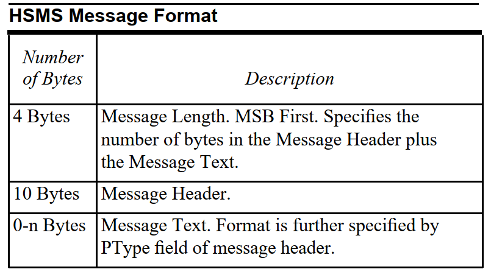

8.1.3   Message Length
Message Length is a four- byte unsigned integer value which specifies the length in bytes of the Message Header plus the Message Text. Message Length is transmitted most significant byte (MSB) first and least significant byte (LSB) last. The minimum possible Message Length is 10 (Header only). The maximum possible Message Length is implementation-specific.
> Message Length是一个4字节的无符号整数值，指定了Message Header和Message Text的长度（以字节为单位）。Message Length的最小值为10（仅包含Message Header）。

8.1.4   Message Header
The Message Header is a ten-byte field. The bytes in the header are numbered from byte 0 (first byte transmitted) to byte 9 (last byte transmitted). The format of the Message Header is as follows:
> Message Header是一个10字节的字段。Message Header的字节如下所示：

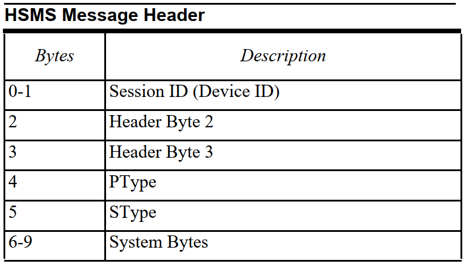

The physical byte order is designed to correspond as closely as possible to the SECS-I header.
> 物理字节顺序被设计为尽可能和SECS-I Message Header类似。

8.1.4.1 Session ID
Session ID is a 16-bit unsigned integer value, which occupies bytes 0 and 1 of the header (byte 0 is MSB, 1 is LSB). Its purpose is to pro- vide an association by reference between control messages (particularly Select and Deselect) and subsequent data messages.  It is the role of HSMS sub- sidiary standards to specify this association further.
> Session ID是一个16位的无符号整数值，占用前两个字节。目的是为了提供control message和后续data message之间的关联。

8.1.4.2   Header Byte 2
This header byte is used in different ways for different HSMS messages. For Con- trol Messages (see SType, below) it contains zero or a status code. For a Data Message whose PType (see below) = 0, it contains the W-Bit and SECS Stream. For a Data Message with PType not equal to 0, see "Special Considerations."
> 该字节不同的HSMS消息有所不同。对于control message，包含0或者状态代码。对于PType = 0的data message，他包含W-bit和stream编号。

8.1.4.3   Header Byte 3
This header byte is used in different ways for different HSMS messages. For Con- trol Messages, it contains zero or a status code. For a Data Message whose PType (see below) = 0, it con- tains the SECS Function. For a Data Message with PType not equal to 0, see "Special Considerations."
> 该字节不同的HSMS消息有所不同，对于control message，包含0或者状态代码。对于PType = 0的data message，它包含function编号。

8.1.4.4   PType
PType (Presentation Type) is an 8- bit unsigned integer value which occupies byte 4 of the header. PType is intended as an enumerated type defining the presentation layer message type:  how the Message Header and Message Text are encoded. Only PType = 0 is defined by HSMS to mean SECS-II mes- sage encoding. For non-zero PType values, see "Spe- cial Considerations."
> PType(Presentation Type)是一个8位无符号整数值，占用Message Header的第四个字节，PType定义了消息的编码。对于SECS-II消息，PType = 0。

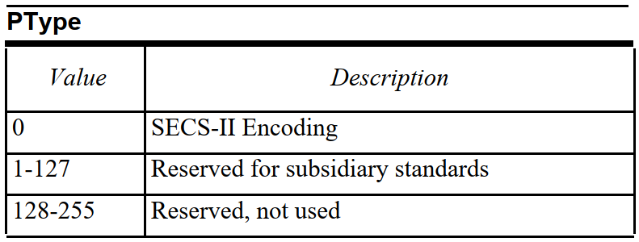

8.1.4.5   SType

SType (Session Type) is a one-byte unsigned integer value which occupies header byte 5. SType is an enumerated type identifying whether this message is an HSMS Data Message (value = 0) or one of the HSMS Control Messages (other). Those values not explicitly defined in the table are addressed in "Special Considerations."

> SType(Session Type)是一个8位无符号整数值，占用Message Header的第五个字节。SType是一个枚举类型，用于标识HSMS消息是data message还是control message。

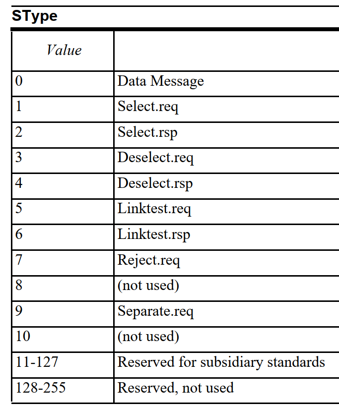

8.1.4.6  System Bytes
System Bytes is a four-byte field occupying header bytes 6-9. System Bytes is used to identify a transaction uniquely among the set of open transactions.
> System Byte是一个4字节的字段，占用Message Header的6-9个字节。System Bytes用于在所有打开的transaction中标识唯一的transaction

Uniqueness — The System Bytes of a Primary Data Message, Select.req, Deselect.req, or Linktest.req message must be unique from those of all other currently open transactions initiated from the same end of the connection. They must also be unique from those of the most recently completed transaction.
> 唯一性——在同一端发起的Primary Data Message，select.req, deselect.req或者linktest.req消息的System Bytes必须保持唯一。

Reply Message — The System Bytes of a Reply Data Message must be the same as those of the corresponding Primary Message. The System Bytes of a Select.rsp, Deselect.rsp, or Linktest.rsp must be the same as those of the respective ".req" message.
> 回复消息 —— data message的系统字节必须和相应的主消息的系统字节相同。select.rsp，deselect.rsp和linktest.rsp的系统字节必须和各自的req消息相同。

### 8.2 HSMS Message Formats by Type 按类型分类的HSMS消息格式

The specific interpretation of the header bytes in an HSMS message is dependent on the specific HSMS message type as defined by the value of the SType field. The complete set of messages defined is summarized in the table below, shown for PType = 0 (SECS-II message format).
> HSMS Message Header 中具体字节的意义取决于SType字段的值。下表总结了在PType = 0时的消息集合的定义

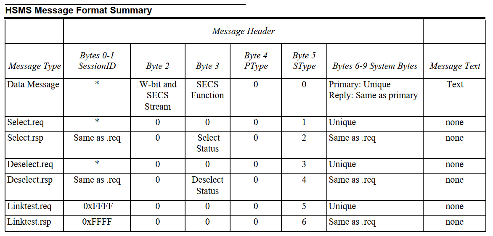
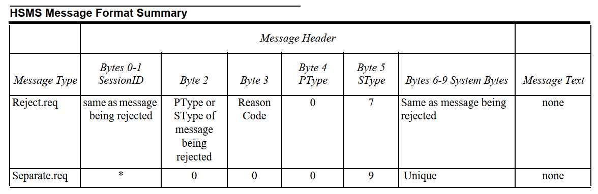
> *的意思是由附属标准进一步规范

8.2.1 SType = 0:Data Message
An HSMS message with SType = 0 is used by the HSMS Data procedure to send a Data message, either Primary or Reply. The message format is as follows:

> 一个SType = 0的HSMS消息用于在数据流程中发送data message，可以是主消息或者次消息。消息格式如下所示：

HSMS Message Length is always 10 (the length of the header alone) or greater.

> HSMS Message Length 的大于等于10。（仅包含消息头时，为10）

The HSMS Message Header is as follows:

> HSMS Message Header 如下所示：

- Session ID — As described above. Specific value subject to subsidiary standards.
   > Session ID —— 描述参考8.1.4.1 Session ID，具体的值依赖于附属标准
- Header Byte 2 — For messages with PType value = 0 (SECS-II), header byte 2 is formatted as shown below.
  > Header Byte 2 —— 对于SECS-II消息（PType = 0），header byte 2的格式如下所示：
  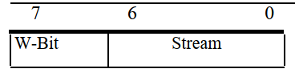
  
  The most significant bit (bit 7) of Header Byte 2 is the W-Bit. In a Primary Message, the W-Bit indicates whether the Primary Message expects a Reply message. A Primary Message which expects a Reply should set the W-Bit to 1. A Primary Message which does not expect a Reply should set the W-Bit to 0. A Reply Message should always set the W-Bit to 0. The low-order 7 bits (bits 6-0) of Header Byte 2 contain the SECS Stream for the message. The Stream is a 7-bit unsigned integer value, which identifies a major topic of the message, and its use is defined within SEMI E5 (SECS-II).
  > header byte 2 中最重要的一位(第七位)是W-bit。在主消息中W-bit用于表示主消息是否需要回复。需要回复的主消息将W-bit设置为1，否则设置为0。次消息中W-bit永远为0。header byte 2的低7位（6-0）表示消息的SECS消息的stream编号。stream是一个7位的无符号整数值，用于表示消息的主题，具体参考SEMI E5。
- Header Byte 3 — For messages whose PType value=0, header Byte 3 contains the SECS Function for the message. The Function is an 8-bit unsigned integer value which identifies a minor topic of the message (within the Stream), and its use is defined within SEMI E5 (SECS-II). The least significant bit (bit 0) of the Function defines whether the Data Message is Primary or Reply; the value 1 indicates Primary and the value 0 indicates Reply.
  > header byte 3 —— 在SECS-II消息（PType = 0）的消息中，header byte 3包含消息的function编号，是一个8位的无符号整数，用于定义stream中的特定功能。具体参考SEMI E5。function的奇偶性（最低位为0或1）表示消息是主消息还是次消息，奇数表示主消息，偶数表示次消息。
- PType —— PType = 0表示SECS-II消息
- SType —— SType = 0表示data message
- System Bytes —— For PType=0 (SECS-II), the following definition applies. For a Primary Message, System Bytes contain a value uniquely identifying this transaction from all other open transactions initiated from the same end of the Connection. For a Reply Message, System Bytes contain the same value as the corresponding Primary Message.
  > 对于SECS-II消息（PType = 0）,使用如下定义：对于主消息，system bytes的值用于唯一标识从HSMS连接的同一端发起的事务。对于次消息，system bytes的值和主消息保持一致。

The HSMS Message Text contains the text of the Data Message (if any), formatted as specified by the PType field. For PType = 0, the text will be formatted as SECS-II messages.

> HSMS Message Text包含data message的文本，格式由PType字段指定。对于PType = 0，文本将被格式化为SECS-II格式的消息。

Note: Some Data Messages consist of header only, with no text.

> 注意：一些data message只包含message header，不包含message text

8.2.2 SType = 1：Select.req

An HSMS message with SType 1 is a "Select Request" Control Message, which is used by the initiator of the procedure for establishing HSMS communications. The message format is as follows:

> SType = 1的HSMS消息表示select.req控制消息，该消息用于建立HSMS通信。消息的格式如下所示：

1. Message Length is always 10 (Header only).

   > Message Length为10，即仅包含Message Header

2. The HSMS Message Header is as follows:

   > Message Header如下所示

   - SessionID — As described above. Specific value subject to subsidiary standards.
     > Session ID——参考Session ID
   - Header Byte 2 = 0
   - Header Byte 3 = 0
   - PType = 0.
   - SType = 1
   - System Bytes — A unique value among open transactions.
     > 在所有打开的事务里是唯一的

8.2.3 SType = 2：Select.rsp
An HSMS message with SType 2 is a "Select Response" Control Message, used as the response to a Select.req Control message in the procedure for establishing HSMS communications. The message format is as follows:

> SType = 2的消息是select.rsp控制消息，用于建立HSMS通信过程中对select.req控制消息进行响应

1. Message Length is always 10 (Header only).
2. The HSMS Message Header is as follows:

- SessionID -- must be equal to the value of the session ID in the corresponding Select.req.
- Header Byte 2 =0
- Header Byte 3 — SelectStatus.  A code of zero indicates success of the Select operation. A non-zero code indicates failure.
   > 响应代码为0表示Select过程成功，非0表示失败

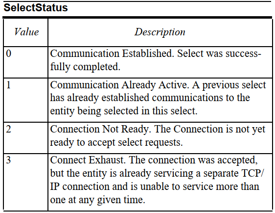
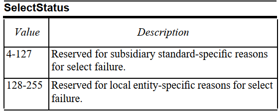

- PType = 0
- SType = 2
- System Bytes -- Equal to value of System Bytes in the corresponding Select.req.

8.2.4 SType=3: Deselect.req

An HSMS message with SType 3 is a "Deselect Request" Control Message, used by the initiator of the Select procedure for ending HSMS communication. The message format is as follows:

> SType = 3的消息是deselect.req控制消息，由select过程的发起者结束HSMS通信。

1. Message Length is always 10 (Header only).
2. The HSMS Message Header is as follows:

- SessionID — The SessionID must match the value of the SessionID of a previously sent Select.req to indicate the particular HSMS session that is ending. Subject to further specification by subsidiary standards.
- Header Byte 2 = 0
- Header Byte 3 = 0
- PType = 0
- SType = 3
- System Bytes — A unique value among open transactions.

8.2.5 SType=4: Deselect.rsp

An HSMS message with SType 4 is a "Deselect Response" Control Message, used as the response to a Deselect.req Control message in the Deselect procedure for ending HSMS communications. The message format is as follows:

> SType = 4的HSMS消息是deselect.rsp的控制消息，用于deselect.req控制消息的响应。信息格式如下所示：

1. Message Length is always 10 (Header only).
2. The HSMS Message Header is as follows:

- SessionID — must equal the session ID in the corresponding Deselect.req
- Header Byte 2 = 0
- Header Byte 3 -- DeselectStatus.  A code of zero indicates success of the Deselect operation. A non-zero code indicates failure.

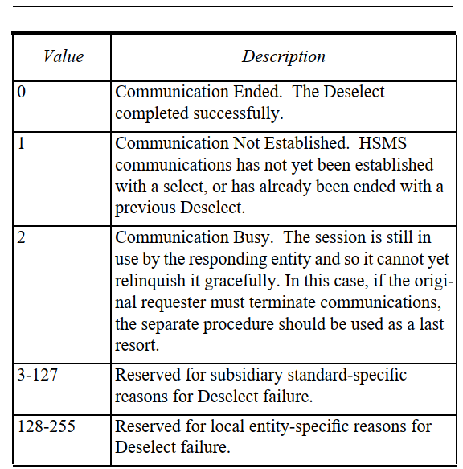

- PType = 0
- SType = 4
- System Bytes — Equal to System Bytes in corresponding Deselect.req.

8.2.6 SType=5: Linktest.req

An HSMS message with SType 5 is a "Linktest Request" Control Message. It is used to verify the integrity of the HSMS Connection, or as a periodic heartbeat. The message format is as follows:

> SType = 5的HSMS消息是linktest.req的控制消息，用于验证HSMS连接的完整性，或者作为心跳包。消息格式如下所示：

1. Message Length is always 10 (Header only).
2. The HSMS Message Header is as follows:

- SessionID = 0xFFFF (in binary, all ones)
- Header Byte 2 = 0
- Header Byte 3 = 0
- PType = 0
- SType = 5
- System Bytes — A unique value among open transactions.

8.2.7   SType=6: Linktest.rsp

An HSMS message with SType 6 is a "Linktest Response" Control Message, used as the response to a Linktest.req Control message in the Linktest Procedure. The message format is as follows:

> SType = 6的HSMS消息是linktest.rsp的控制消息，用于在linktest过程中linktest.req控制消息的响应。消息格式如下所示：

1. Message Length is always 10 (Header only).
2. The HSMS Message Header is as follows:

- SessionID = 0xFFFF (binary, all ones)
- Header Byte 2 = 0
- Header Byte 3 = 0
- PType = 0
- SType = 6
- System Bytes — Equal to System Bytes in corresponding Linktest.req.

8.2.8   SType=7: Reject.req

An HSMS message with SType 7 is used in response to any valid HSMS message received which is not supported by the receiver of the message or which is not valid at the time. It is intended for dealing with attempts to use subsidiary standards or user-defined extensions which are not supported by the receiver (for example, SType equal to any value not defined in this standard). It must be used when an entity receives a control message which is a response (even numbered SType) for which there was no corresponding open transaction.

> 对于SType = 7的HSMS消息可以用于响应任何有效的HSMS消息，该有效的HSMS消息可能是由于响应方不支持，或者在当时的状态下无效。当entity接受到作为响应的控制消息（偶数编号的SType）而无法打开对应的事务时，使用reject.rsp消息。

The HSMS Message Header is as follows:

- SessionID — equal to the value of the Session ID in the message being rejected.
  > 等于被拒绝消息的Session ID
- Header Byte 2 — For ReasonCode = PType Not Supported, equal to the PType in the message being rejected. Otherwise equal to the value of the SType in the message being rejected.
  > 当PType不支持时，相应代码为被拒绝消息的PType（SECS-II消息中PType非0时不支持）。否则该值表示被拒绝消息的SType。
- Header Byte 3 — reason code (always non-zero)
  > 相应代码，永远都是非0值

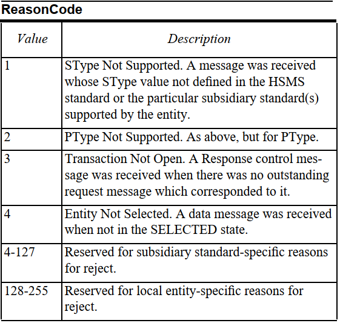

- PType = 0
- SType = 7
- System Bytes — Equal to System Bytes in corresponding message being rejected.
  > 和相应的被拒绝的消息的System Bytes相同

8.2.9   SType=9: Separate.req

An HSMS message with SType = 9 is used to terminate HSMS communications immediately. With the exception of the SType value, it is identical to the Deselect.req message. Its purpose is to end HSMS communications immediately and without exception. No response is defined.
> SType = 9的HSMS消息用于立即中止HSMS通信。除了SType值外，和Deselect.req消息完全相同，用于单方面的立即中止HSMS通信。该消息不需要响应。

## 第九章 特殊情况

### 9.1 General Considerations

> 一般情况

Communications Failures

If a communications failure is detected, the entity should terminate the TCP/IP connection. Upon termination of the connection, the entity may, at this point, attempt to reestablish communications.
> 如果检测到communication failure，则该entity应中止TCP/IP连接，进入NOT CONNECTED状态。连接终端后，该entity可以在此时尝试重新建立通信。

### 9.2 TCP/IP Considerations

> TCP/IP情况

Connect Separation Time(T5)
> 连接分离时间（T5）

The connect procedures initiate some network activity. Frequent use of the active mode connect procedure to the IP Address and Port Number of an entity not yet ready to accept connections can be hostile to TCP/IP operations. The passive mode does not generate network activity and is not considered hostile to the network, although it may affect local application performance. An Entity initiating a connection in the active mode should limit its use of the connect procedure in a man- ner that is equivalent to the procedure described here.

> 连接过程启动一些网络活动。频繁使用主动模式连接到还没有准备好接受的IP地址和端口对TCP/IP操作有影响。被动模式不会产生网络活动，也不会认为对网络有影响，尽管他可能会影响本地程序的性能。

After an active connect procedure terminates by any means (successfully or unsuccessfully), the Entity should not initiate another active connect procedure (for the same Remote Entity) until the T5 Connect Separation Time has elapsed. The separation of connect operations will be the sum of the T5 Connect Sep- aration Time interval, plus the duration of the connect operation itself.
> 在一个主动连接过程通过任何方式中断后，某entity不应该立即启动另一个主动连接，直到T5 Connect Separate Time过去。连接操作的间隔，应该是T5连接间隔时间加上连接操作本身的时间的总和。

NOT SELECTED Timeout(T7)
> NOT SELECTED 超时（T7）

Entry into the NOT SELECTED state is achieved either by state transition #2 (establishment of a TCP/IP connection). There is a time limit on how long an entity is required to remain in the NOT SELECTED state before either entering the SELECTED state or by returning to the NOT CONNECTED state.
> 可以通过#2状态转换（建立TCP/IP连接）进入NOT SELECTED状态。在entity进入SELECTED状态或者返回NOT CONNECTED状态有一个时间限制，因此定义了T7。

Some entities, particularly those unable to accept more than a single TCP/IP connection, may be impaired in their operation by remaining in their NOT SELECTED state as they will be unavailable for communications with other entities. Such entities shall disconnect the TCP/IP connection (State Transition Event #3) if com- munication remains in the NOT SELECTED state for longer than the T7 timeout period.
> 一些实体，尤其是那些无法接受多个TCP/IP连接的实体，可能会因为保持NOT SELECTED状态而无法和其他entity进行通信。如果通信保持在NOT SELECTED状态的时间超过T7，则该entity应断开TCP/IP连接（#3状态转换）

Network Intercharacter Timeout (T8)
> 网络字符间超时（T8）

Because TCP/IP is a stream rather than a message pro- tocol, it is possible that bytes which are all part of a single HSMS message may be transmitted in separate TCP/IP messages without any violation of the TCP/IP protocol. Since it is possible that these separate mes- sages may be separated by a substantial period of time, the Network Intercharacter Timeout (T8) is defined.
> 因为TCP/IP是一个流而不是一个消息协议，所以单个HSMS消息的一部分字节可能在单独的TCP/IP消息中传输，而不会违反TCP/IP协议。由于这些单独的消息可能相隔一段相当长的时间，因此定义了网络字符间超时（T8）

T8 is similar in purpose to the SECS-I T1 timer except that the communications issues which necessitate T8 are not entirely in the control of the sender of the mes- sage. Therefore, it is defined only in terms of the receiver of the message. In particular, if after receipt of a partial message, the T8 timeout period expires prior to receipt of the complete message, the receiving entity shall consider such case as a communications failure, as defined above.
> T8在墓地上与SECS-I的T1计时器相同，应由消息的响应方定义。如果在收到部分消息后，T8超时时间内没有收到完整消息，响应方应视为communication failure。

Multiple Connection Requests Directed to a Single Published Port

> 单个port的多个连接请求

Once a passive entity has accepted a connection on its published port, TCP/IP permits (though does not require) the entity to listen for and accept additional connections directed to the same published port.

> 一旦被动模式的entity在开发的port上接受了一个连接，TCP/IP就允许（但不要求）该entity监听并接受同一端口的其他连接。

HSMS permits (though does not require) entities to operate in this manner. However, for the purposes of HSMS compliance, each connection so formed must exhibit the behavior defined in the HSMS state dia- gram as if it were completely independent of any other connection to the same published port.

> HSMS允许（但不要求）entity以这种方式要求。然而为了遵循HSMS协议，这样建立的连接必须满足HSMS状态图中定义的行为，且完全独立于该端口的其他连接。

Rejection of Additional Connection Requests by a Passive Mode Entity

> 被动模式的entity拒绝额外的连接请求

A passive mode entity unable to service more than a single TCP/IP connec- tion for HSMS communications will follow one of these three procedures with respect to additional connection requests.

> 无法接受多个TCP/IP连接请求的被动模式的entity，将按照以下的方式处理额外请求

1. Accept the connection, but always respond to any subsequent HSMS select procedures with the Com- munication Already Active response code. For the purpose of the HSMS State Diagram, the connect procedure terminates successfully (enters CONNECTED state), but HSMS communications are never established (remain in NOT SELECTED substate). This is the preferred option in that it can provide the most information to the remote entity as to why the connection is refused (see HSMS Select Procedure), but places an addition imple- mentation requirement on the local entity.
   > 接受连接，但总是用"通信已激活"响应代码响应后续所有的select过程。在HSMS状态图中，连接过程成功结束（进入CONNECTED状态），但HSMS通信未建立（保持在NOT SELECTED子状态）。这是首选项，因为它可以向remote entity提供连接被拒绝最多原因，但是对local entity提出了额外的实现要求。

2. Actively reject the connection request. This can be done in a TLI implementation using the t_snddis procedure. This will cause the connect procedure in the remote entity to terminate unsuccessfully. This option may not be available to all implementations because some API’s, notably some implementa- tions of BSD Sockets, do not provide for initiating an active reject. Note, however, that all TCP/IP implementations, including BSD Sockets, properly respond to an active reject from the remote entity.
   > 主动拒绝连接请求。这可以使用t_snddis过程中的TLI实现。这会导致remote entity的连接过程非正常中断。这种方式不使用于所有的情况，因为一些TCP/IP的API不提供主动拒绝的操作。但是所有TCP/IP都响应来自remote entity的主动拒绝。

3. Refuse to listen for or accept the connect request. No action is taken in the local entity: the remote entity's connect procedure will eventually time out. This option is permitted, but not recommended, as it can cause considerable delay on the part of the remote entity.  However, it may be the only alterna- tive available to implementations with network resource limitations.
   > 拒绝监听或者接受连接请求。在local entity中不采取任何操作，remote entity的连接过程最终将超时。这个选型是允许的但是不推荐使用，因为他可能会导致remote entity有相当大的延迟。对于网络资源有限的实体来说，这可能是唯一可用的替代方案。

The documentation of the passive local entity shall indicate which means it uses to refuse connections.
> 被动模式的local entity的文档要写明要使用何种方式拒绝连接。

### 9.3 HSMS特有的情况

9.3.1 Control Transactions T6 Control Timeout

> 控制事务T6控制超时

A number of the control messages are part of procedures which require a message exchange or transaction: <xx>.req from the initiator of the control service, fol- lowed by an <xx>.rsp from the receiver of the <xx>.req in response to it. A control transaction is considered open from the time the <xx>.req request is sent until the time the <xx>.rsp is received.

> 许多控制消息是信息交换和事务前提一部分：由发起者的req消息，和响应者的rsp消息组成。控制事务是从发送req消息开始，收到rsp消息结束。

The time a control transaction may remain open is sub- ject to the T6 control transaction timeout. Upon initia- tion of a control transaction, the local entity should set a timer whose duration is equal to the T6 timeout value. If the transaction is properly closed prior to the expiration of the timer, the timer should be canceled. If the timer expires prior to the proper closing of the transaction, the transaction shall be considered closed by the initiator and considered an HSMS communica- tions failure.

> 控制事务保持打开的时间受限于T6事务超时。在控制事务启动的时候，local entity要设置一个等于T6的计时器。如果在计时器到期之前正确关闭了事务，则应该取消计时器。如果在计时器在事务正确关闭之前结束，则事务的发起者认为事务已关闭，并认为是HSMS通信失败。

9.3.2   Procedures and "Stateless" Transactions

> 流程和无状态事务

Most of the HSMS control procedures involve a trans- action: the initiator sends a request message to the responding entity and waits for a response message. The responding entity receives the initiator's request message and sends a reply.

> 大多数HSMS控制过程涉及到一个事务：发起者向响应者发送request消息并等待response消息，响应者接受发起者的request消息并发送response消息。

Note that such transactions are "stateless" in the following sense: while the initiator of a transaction is waiting for a response, it may receive a message other than that response, and this message may be any message valid for the state the initiator was in at the time the original transaction was initiated. For example, the two entities may simultaneously initiate transactions. As a result, no states for "TRANSACTION OPEN" or "TRANSACTION NOT OPEN" are reflected in the HSMS state machine. The use of such state informa- tion in an implementation is strictly a local entity-specific issue.

> 请注意，这样的事务在以下场景下是无意义的：当事务的发起者正在等待响应时，他可能会收到与该响应不同的消息，并且该消息可能是发起者在之前事务的任何有效消息。例如，两个entity可能同时发起事务。因此HSMS状态机没有响应"Transaction Open"或者"Transaction Not Open"的状态，实际情况下这是一个特定的问题。

9.3.3   Alternative Message Types and Header Byte Values

> 可选消息类型和Message Header字节值

The HSMS standard does not completely define all possible enumerated values of either the PType or SType field. Further, Header bytes 2 and 3 have a format determined by the PType for messages whose SType is equal to 0, but is otherwise specified for all other SType values. The message text format- ting is defined by the PType as well, but only for data messages.

> HSMS协议没有完全定义PType和SType可能的枚举值。此外，对于data message，PType = 0确定了Message Header 2，Message Header 3，以及Message Text的格式。

Subsidiary standards must be consistent with this con- vention. In particular, for SType = 0, subsidiary stan- dards defining PType values not equal to 0 may specify both the message text encoding and the interpretation of header bytes 2 and 3. For STypes not equal to 0 but otherwise specified in this standard, PType must = 0, and no message text may be transmitted. For STypes defined in subsidiary standards, the meaning of header bytes 2 and 3 may be specified on a per SType value basis, and these STypes may optionally define message text as long as the PType field is used in a manner con- sistent with the preceding paragraph.

> 附属标准必须和HSMS协议一致。特别的，对于data message，PType不等于0的附属标准可以同时指定Message Text编码和Message Header 2和3的解释。对于不等于0但是本标准另有规定的类型，则PType必须为0，不允许发送消息文本。对于附属标准中定义的类型，Message Header 2和3的含义可以在每个SType值的基础上进行定义，只要PType字段的使用方式与之前一致。

### 9.4   SECS-II Considerations

> SECS-II情况

The SECS-II standard (SEMI E5) makes certain references to SECS-I (SEMI E4). This section addresses issues specific to SECS-II when HSMS is used to transport SECS-II messages.

> SECS-II标准（SEMI E5）参考了SECS-I（SEMI E4）。当使用HSMS传输SECS-II消息时，本节的目的是解决SECS-II特有的问题

9.4.1   Reply Matching

> 回复匹配

When a Sender sends a Primary Message with W-Bit 1 (Reply Expected), the Sender should expect a  Reply message whose header meets the following requirements.

> 当发送方发送w-bit为1的主消息时，发送方应该期望收到一个Message Header满足以下要求的回复消息

- The SessionID of the Reply must match the SessionID of the Primary Message.
  > 次消息的SessionID必须和主消息的SessionID相同

- The Stream of the Reply must match the Stream of the Primary Message.
  > 次消息的stream必须和主消息的steam相同

- The Function of the Reply must be one greater than the Function of the Primary Message, or else the Function of the Reply must be 0 (Function Zero Reply).
  > 次消息的function必须比主消息的function大1，否则次消息的function必须为0

- The System Bytes of the Reply must match the System Bytes of the Primary Message.
  > 次消息的System Bytes必须和主消息的System Bytes相同

9.4.1.1 T3 Reply Timeout

> T3回复超时

The T3 reply timeout is a limit on the length of time that the HSMS message protocol is willing to wait for a Reply message.

> T3回复超时是HSMS等待次消息的最长时间

After sending a Primary Message with W-bit 1 (Reply Expected), the sender must begin a reply timer, initialized to the T3 value. If the sender does not receive the Reply Message before the reply timer expires, then a T3 Timeout Error has occurred. The sender should close the transaction and no longer expect the Reply Message.

> 发送一个w-bit为1的主消息后，发送方必须开始一个值为T3的回复计时器。如果发送方在计时器超时之前没有收到回复，则发生T3超时错误。发送方应关闭事务，不再期望收到回复消息。

Each open transaction for which a Reply is expected requires a separate reply timer.

> 每个需要回复的打开的事务，都幼一个单独的计时器。

9.4.2   Stream 9 Messages

> stream 9 消息

The SECS-II standard defines error messages S9F1, S9F3, S9F5, S9F7, S9F9, and S9F11, with message text containing the SECS-II Data Items MHEAD or SHEAD, which are defined to contain a 10-byte SECS-I block header.

> SECS-II标准定义了错误消息S9F1，S9F3，S9F5，S9F7，S9F9，S9F11。这些消息的Message Text包含SECS-II数据项MHead或者SHead。

When using SECS-II with HSMS, MHEAD and SHEAD should contain the ten bytes of the HSMS Message Header.

> 当HSMS使用SECS-II消息是，MHead和SHead应该包含10个字节的HSMS Message Header。

## 10 HSMS Documentation

An HSMS implementation is required to document the following information:

1. Method for setting protocol parameters (see Section 10.1).
2. Range allowed and resolution for each parameter.
3. The option used for refusing incoming connection requests if the implementation uses the passive mode for TCP/IP connection establishment.
4. Maximum message size which can be received.
5. Maximum expected size of messages sent.
6. Maximum number of supported concurrent open transactions.

10.1   Parameter Setting

Implementations of HSMS must provide for installation time setting of the following parameters. The range and resolution of all param- eters must be at least as shown in the table. All parameters must be stored in such a manner that the settings will be retained if the power fails or if the sys- tem software is reloaded.
