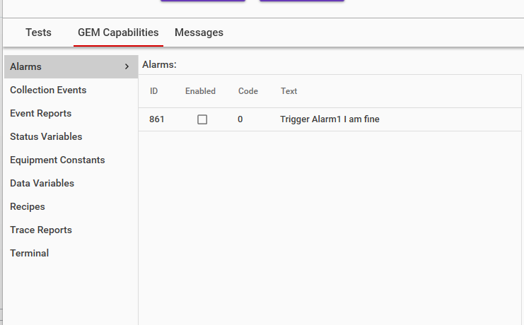
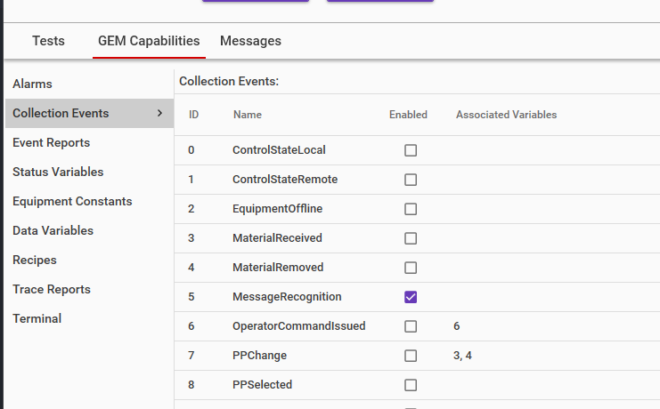
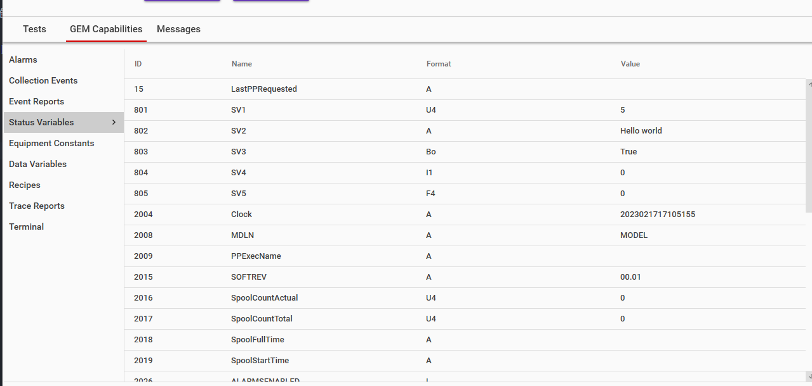
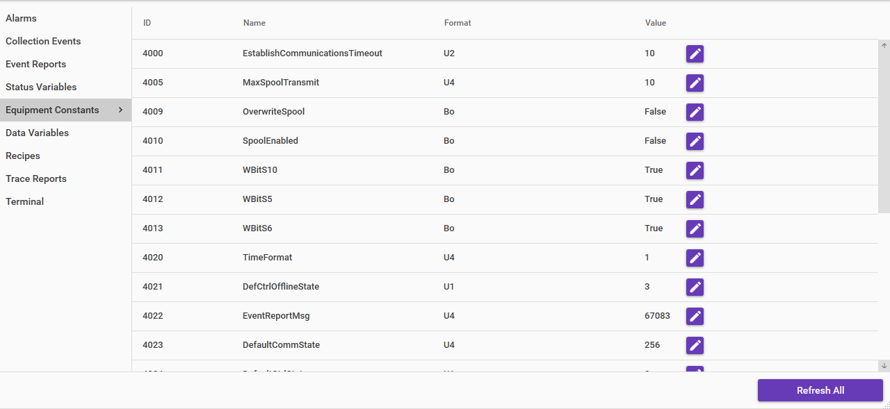
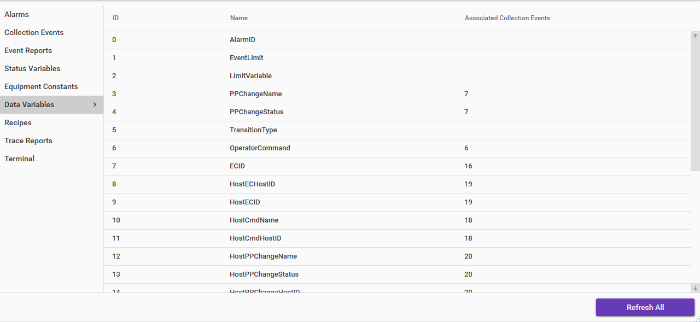

# 说明

## 汇报CEID List，VID List，AlarmList

在Host通过S1F13和S1F14连接到Equipment后，

- Host会通过S5F5询问Alarm List，Equipment要发送S5F6汇报Alarm List，这个表示向主机汇报所有的定义的Alarm
- Host会通过S5F7询问Enable Alarm List，Equipment要发送S5F8汇报Enable Alarm List，这个表示向主机汇报所有启用的Alarm

- Host会通过S1F23询问CEID List，Equipment要发送S1F24汇报CEID List

- Host会通过S1F11询问SVID List，Equipment要发送S1F12汇报SVID List
- Host会通过S1F3询问SVID的值，Equipment要发送S1F4汇报SVID的值

- Host会通过S2F29询问ECID List，Equipment要发送S2F30汇报ECID List
- Host会通过S2F13询问ECID的值，Equipment要发送S2F14汇报ECID的值

- Host会通过S1F21询问DVID List，Equipment要发送S1F22汇报DVID List

- Host会通过S7F19询问设备Recipe文件的目录，Equipment要发送S7F20汇报PPID的列表

必备命令如下：
S5F6，S5F8，S1F24，S1F12，S1F4，S2F30，S2F14，S1F22，S7F20

## Recipe的格式说明

需要写一个文档，告诉通富的IT，传送的Recipe怎么解析。
传送Recipe时，不是直接传送文件，是传送文件里的内容。
