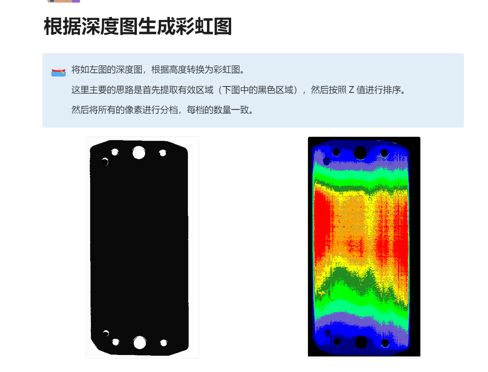

1. 目前已明确上下料载体为塑料托盘，图纸见附件，以此为载体的自动化上下料方式需要在方案中体现出来
    > 方案更新后以邮件的形式发出
2. 重复测量精度是否可以达到10μm；如不能，能达到多少
   > 可以满足10μm的重复精度
3. 整机测量时间（包含自动上下料）为多少，UPH是否能达到800；如不能，能达到多少
    > 单片产品4秒，UPH为900
4. 传感器是否具备扫三维曲面功能，是否可用VR-5000软件处理三维数据；如不能，是否可提供其他数据处理软件
    > 传感器具备扫三维曲面的功能，但是我们未使用三维曲面进行计算，我们使用深度图进行计算。深度图可以理解为是三维曲面的俯视图，支持生成彩虹图，截面数据等。
    
5. 设备是否可扩展pin针位置度全检功能
    > 如果已确定pin针要检测的数据，可以发给我们评估后再给出答复
6. 设备是否可连外网，将数据存储在云端，让客户远程监控；如不能连外网，是否可通过其他方式实现数据云端存储
    > 设备无法连外网，可以连通富内网。设备可以将测量的所有数据上传给通富的系统。
7. 当前设计方案是否兼容MIP2+MIP3+产品外形，以上产品改变时是否需要改机，如需改机需要多久
    > 可以兼容
8. 建议设备校准周期为多久
    > 设备一般不需要校正，如果有这种需求，我们可以提供一个陶瓷标准块，用于定期检测设备精度。
