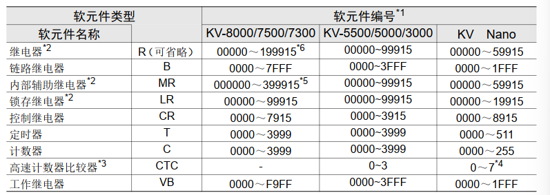

# 基恩士PLC链路通讯命令

## 更改模式 M1/M0

```C#
M0\r
M1\r
```

- 指定“0”时，CPU 单元切换到 PROGRAM 模式。
- 指定“1”时，CPU 单元切换到 RUN 模式。
- 命令正常处理时，回复OK
- 错误响应
  - E1：命令异常
  - E2：未登录程序
  - E5：单元错误

## 清除错误 ER

```C#
ER\r
```

- 用于清除 CPU 单元中发生的错误
- 命令正常处理时，回复OK
- 错误响应
  - E1：命令异常

## 检查错误编号 ?E

```C#
?E\r
```

- 用于检查 CPU 单元中发生的错误或异常。
- 命令正常处理时，回复与 CPU 中发生的错误相对应的错误编号（不消零）。如果 CPU 没有发生错误，则回复“000”。
- 错误响应
  - E1：命令异常
- 常用错误过多，用不上，略

## 查询机型 ?K

```C#
?K\r
```

- 用于查看 PLC 的型号。
- 回复PLC型号，如 KV8000 回复 57
- 错误响应
  - E1：命令异常

## 检查运行模式 ?M

```C#
?M\r
```

- 用于查看 CPU 单元当前的运行状态。
- 输入与 CPU 单元的当前状态（模式）相对应的编号。CPU 单元处于 PROGRAM
模式或未登录梯形图时输入“0”，处于 RUN 模式时输入“1”。
- 错误响应
  - E1：命令异常

## 时间设定 WRT

```C#
WRT 数据1 数据2 数据3 数据4 数据5 数据6 数据7\r
// 数据 1 ：输入西历年份（2 位）。00 表示 2000 年。数值范围为 00 ~ 99。
// 数据 2 ：输入月（2 位）。数值范围为 01 ~ 12。
// 数据 3 ：输入日（2 位）。数值范围为 01 ~ 31。
// 数据 4 ：输入时（2 位）。数值范围为 00 ~ 23。
// 数据 5 ：输入分（2 位）。数值范围为 00 ~ 59。
// 数据 6 ：输入秒（2 位）。数值范围为 00 ~ 59。
// 数据 7 ：输入星期（1 位）。数值范围为 0 ~ 6。 0为周日，依次类推。
```

- 用于设定 CPU 单元的时间。
- 命令正常处理时，回复OK

## 强制置位/强制复位 ST/RS/STS/RSS

```C#
ST 类型+编号\r          // 强制置位
RS 类型+编号\r          // 强制复位
STS 类型+编号 个数\r    // 连续强制置位
RSS 类型+编号 个数\r    // 连续强制复位

// 举例： ST R34000\r
// 举例： STS R34000 16\r
```



- 软元件编号可以消零。
- 高速计数器比较器只能用于 RS 命令（强制复位）
- 命令正常处理时，回复OK
- 错误响应：
  - E0：软元件编号异常
  - E1：命令异常

## 读取数据 RD/RDS

```C#
RD 类型+编号+格式\r                 // 读取一个指定软元件的数据
RDS 类型+编号+格式 个数\r           // 连续读取指定个数的软元件的数据。

// 举例: RD DM200                  // 读取DM200的16位无符号
// 举例：RD DM200 .L               // 读取DM200处的32位有符号
// 举例：RDS DM200 .L 10           // 读取从DM200开始的10个32位有符号
```

- 格式可以省略，或者如下所示。指定为.D/.L时，会将指定编号的软元件作为低 16 位，下一个编号的软元件作为高 16 位，将软元件作为 32 位数据处理。==此时软元件编号必须为偶数==
  - .U 16位无符号十进制
  - .S 16位有符号十进制
  - .D 32位无符号十进制
  - .L 32位有符号十进制
  - .H 16位十六进制HEX
- 类型可能的值：DM

### 读取举例1

发送：`RDS R100 4\r`
响应：`1 0 1 0\r`
解释：R100=ON，R101=OFF，R102=ON，R103=OFF

### 读取举例2

发送：`RDS DM200.S 3\r`
响应：`+15025 -25400 00000\r`
解释：DM200 = +15025，DM201 = -25400，DM202 = 0

## 写入数据 WR/WRS

```C#
WR 类型+编号+格式 数据\r                            // 将数据写入指定的软元件
WRS 类型+编号+格式 个数 数据1 数据2 …… 数据n\r       // 连续写入指定个数的数据
```

- 格式可以省略，或者如下所示。指定为.D/.L时，会将指定编号的软元件作为低 16 位，下一个编号的软元件作为高 16 位，将软元件作为 32 位数据处理。==此时软元件编号必须为偶数==
  - .U 16位无符号十进制
  - .S 16位有符号十进制
  - .D 32位无符号十进制
  - .L 32位有符号十进制
  - .H 16位十六进制HEX
- 类型可能的值：DM
- 正常响应返回OK
- 错误响应：
  - E0：软元件编号异常
  - E1：命令异常
  - E4：禁止写入

### 写入举例1

发送：`WRS R100 4 1 0 1 0\r`
响应：`OK\r`
解释：写入 R100 ~ R103

### 写入举例2

发送：`WRS DM200.S 3 +15025 -005400 200\r`
响应：`OK\r`
解释：写入 DM200 ~ DM202
> 写入数据可以消零。数据为正数时，可省略“+”。

## 写入设定值 WS/WSS

> 略

## 监控器登录 MBS/MWS

> 略

## 读取监控器 MBR/MWR

> 略

## 注释读取 RDC

> 略

## 存储体切换 BE

> 略

## 读取扩展单元缓存存储器

> 略

## 写入扩展单元缓冲存储器

> 略
