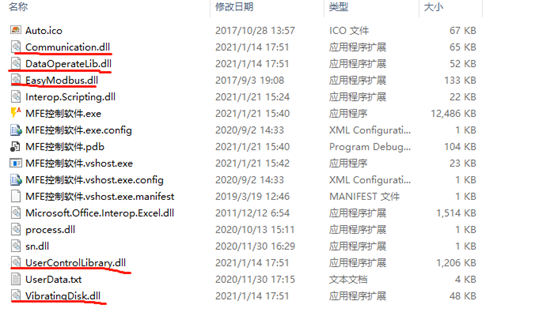

# 谦腾震动盘

## 上位机引用

### 引用Dll

添加如下5个dll的引用


### 常用函数

```C#
VibOperation mVibOperation = new VibOperation();
mVibOperation.StartConnect("com5"); //打开串口，进行连接   
mVibOperation.ReadMotorPra();//读参数                    
mVibOperation.WriteModbusRunPra(6);//开始上下
Thread.Sleep(this.mVibOperation.ListControlPra[6].MotorTime * 100);
mVibOperation.WriteModbusRunPra(5);//开始震散
Thread.Sleep(this.mVibOperation.ListControlPra[5].MotorTime * 100);
mVibOperation.WriteModbusRunPra(1);//开始上
Thread.Sleep(this.mVibOperation.ListControlPra[1].MotorTime * 100);
mVibOperation.WriteModbusRunPra(4);//开始震散
Thread.Sleep(this.mVibOperation.ListControlPra[4].MotorTime * 100);
mVibOperation.WriteMobusStopPra();//停止震动
mVibOperation.DisConnected();     //关闭串口连接
```
